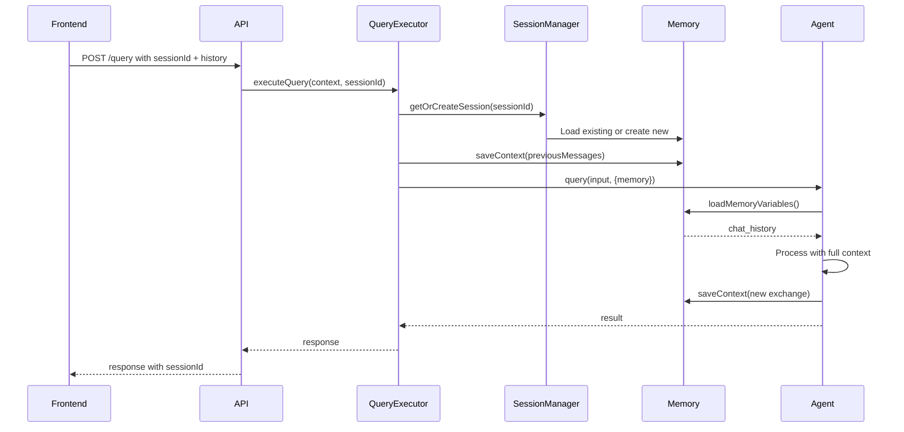

# Memory Implementation Plan for Slack Knowledge Agent

## Executive Summary

The Slack Knowledge Agent has foundational memory infrastructure but lacks proper integration and session management. While the frontend sends conversation history and the backend has memory components, they're not effectively connected to create a true conversational experience. This plan outlines the necessary improvements to implement proper conversation memory according to LangChain and OpenAI best practices.

## Current State Analysis

### What Exists ✅
1. **Frontend sends conversation history**: `useChatManager` hook includes `conversationHistory` in requests
2. **Backend accepts history**: Query route accepts `conversationHistory` parameter
3. **Memory classes exist**: `SlackConversationMemory` implemented with LangChain's BaseMemory
4. **Agent memory support**: `SlackKnowledgeAgent` can accept memory configuration
5. **Context formatting**: Agent formats conversation history into context

### Critical Gaps ❌
1. **Memory not instantiated**: AgentManager creates memory but it's never actually used in query execution
2. **No session management**: All conversations share the same memory instance
3. **History not persisted in memory**: Frontend history isn't saved to LangChain memory
4. **Memory not queried**: Agent doesn't load previous conversation from memory
5. **No conversation isolation**: Multiple users share the same memory space

## Architecture Problems

### Problem 1: Memory Lifecycle Disconnect
```typescript
// AgentManager creates memory globally
if (this.config.memoryEnabled) {
  this.memory = new SlackConversationMemory({...});
}

// But QueryExecutor never uses it properly
// It just passes raw messages as context, not through memory
```

### Problem 2: Conversation History Dual Path
- Frontend sends history as `conversationHistory` array
- Backend has LangChain memory that should maintain history
- These two systems don't communicate

### Problem 3: Session Management Missing
- No concept of conversation sessions
- No user isolation
- No conversation persistence across page refreshes

## Proposed Solution Architecture

### 1. Session-Based Memory Management

```typescript
interface ConversationSession {
  sessionId: string;
  userId?: string;
  memory: SlackConversationMemory;
  createdAt: Date;
  lastAccessed: Date;
  metadata: {
    channels: string[];
    provider: string;
    model: string;
  };
}

class SessionManager {
  private sessions = new Map<string, ConversationSession>();
  
  getOrCreateSession(sessionId: string, userId?: string): ConversationSession {
    // Create isolated memory per session
  }
  
  cleanupExpiredSessions(): void {
    // Remove old sessions after inactivity
  }
}
```

### 2. Proper Memory Integration Flow



### 3. Enhanced Memory Implementation

```typescript
export class EnhancedSlackMemory extends SlackConversationMemory {
  private sessionId: string;
  private userId?: string;
  
  constructor(config: EnhancedMemoryConfig) {
    super(config);
    this.sessionId = config.sessionId;
    this.userId = config.userId;
  }
  
  async syncWithFrontendHistory(messages: ChatMessage[]): Promise<void> {
    // Clear and rebuild memory from frontend state
    await this.clear();
    for (const msg of messages) {
      if (msg.role === 'user') {
        await this.chatHistory.addUserMessage(msg.content);
      } else {
        await this.chatHistory.addAIChatMessage(msg.content);
      }
    }
  }
  
  async getConversationSummary(): Promise<string> {
    // Generate summary for context window management
  }
  
  async compressOldMessages(): Promise<void> {
    // Summarize old messages to stay within token limits
  }
}
```

## Implementation Plan

### Phase 1: Session Management (Week 1)

#### 1.1 Create SessionManager Service
```typescript
// backend/src/services/SessionManager.ts
export class SessionManager implements IInitializableService {
  private sessions = new Map<string, ConversationSession>();
  private cleanupInterval?: NodeJS.Timeout;
  
  async initialize(): Promise<void> {
    // Setup cleanup interval for expired sessions
  }
  
  getOrCreateSession(sessionId: string, config?: SessionConfig): ConversationSession {
    // Return existing or create new session with isolated memory
  }
  
  async clearSession(sessionId: string): Promise<void> {
    // Clear specific session memory
  }
}
```

#### 1.2 Update API Routes
```typescript
// backend/src/routes/query.ts
router.post('/', async (req, res) => {
  const { sessionId = uuidv4() } = req.body;
  // Pass sessionId to QueryExecutor
});

// New endpoint for session management
router.delete('/session/:sessionId', async (req, res) => {
  // Clear session memory
});
```

#### 1.3 Update Frontend to Handle Sessions
```typescript
// frontend/src/hooks/useChatManager.ts
export function useChatManager() {
  const [sessionId] = useState(() => generateSessionId());
  
  const sendMessage = async (message: string) => {
    // Include sessionId in all requests
    const response = await chatApiClient.sendMessage({
      sessionId,
      message,
      conversationHistory: messages,
      // ...
    });
  };
}
```

### Phase 2: Memory Integration (Week 1-2)

#### 2.1 Update QueryExecutor
```typescript
// backend/src/services/QueryExecutor.ts
private async executeQueryInternal(
  context: LLMContext,
  config: Partial<LLMConfig>,
  sessionId: string
): Promise<QueryResult> {
  // Get session-specific memory
  const session = this.sessionManager.getOrCreateSession(sessionId);
  
  // Sync frontend history with memory
  if (context.messages.length > 0) {
    await session.memory.syncWithFrontendHistory(context.messages);
  }
  
  // Get agent with session memory
  const agent = await this.agentManager.getAgent(
    provider, 
    model,
    session.memory // Pass session-specific memory
  );
  
  // Execute with memory context
  const result = await agent.query(context.query, agentContext);
  
  // Memory automatically saved by agent
  return result;
}
```

#### 2.2 Update AgentManager
```typescript
// backend/src/services/AgentManager.ts
public async getAgent(
  provider?: LLMProvider,
  model?: string,
  sessionMemory?: SlackConversationMemory
): Promise<SlackKnowledgeAgent> {
  // Use session memory if provided, otherwise create new
  const memory = sessionMemory || this.createDefaultMemory();
  
  // Create agent with specific memory
  const agent = new SlackKnowledgeAgent(llmProvider, this.tools, {
    ...this.config,
    memory
  });
}
```

### Phase 3: Advanced Features (Week 2)

#### 3.1 Conversation Summarization
```typescript
export class ConversationSummarizer {
  async summarizeConversation(messages: BaseMessage[]): Promise<string> {
    // Use LLM to generate concise summary
  }
  
  async compressHistory(memory: SlackConversationMemory): Promise<void> {
    // Replace old messages with summary to save tokens
  }
}
```

#### 3.2 Context Window Management
```typescript
export class ContextWindowManager {
  private readonly maxTokens = 4000;
  
  async optimizeContext(
    messages: BaseMessage[],
    priority: 'recent' | 'relevant'
  ): Promise<BaseMessage[]> {
    // Smart selection of messages within token limit
  }
}
```

#### 3.3 Persistence Layer (Optional)
```typescript
interface IMemoryPersistence {
  save(sessionId: string, messages: BaseMessage[]): Promise<void>;
  load(sessionId: string): Promise<BaseMessage[]>;
  delete(sessionId: string): Promise<void>;
}

export class RedisMemoryPersistence implements IMemoryPersistence {
  // Persist conversations to Redis for cross-session continuity
}
```

## Best Practices Implementation

### 1. LangChain Best Practices
- **Use BufferWindowMemory**: For token-limited contexts
- **Implement ConversationSummaryMemory**: For long conversations
- **Entity Memory**: Track entities mentioned across conversation
- **Knowledge Graph Memory**: Build relationships between concepts

### 2. OpenAI Best Practices
- **System Message Consistency**: Maintain role throughout conversation
- **Context Relevance**: Include only relevant history
- **Token Optimization**: Compress older messages
- **Clear Conversation Boundaries**: Mark conversation starts/ends

### 3. User Experience Best Practices
- **Session Persistence**: Store sessionId in localStorage
- **Clear Conversation**: Provide explicit "New Chat" button
- **Export/Import**: Allow users to save/load conversations
- **Privacy Controls**: Clear history on demand

## Configuration Updates

### Environment Variables
```env
# Memory Configuration
MEMORY_ENABLED=true
MEMORY_MAX_TOKENS=2000
MEMORY_MAX_MESSAGES=20
MEMORY_SESSION_TTL_MINUTES=60
MEMORY_CLEANUP_INTERVAL_MINUTES=10
MEMORY_PERSISTENCE_ENABLED=false
MEMORY_PERSISTENCE_TYPE=redis
```

### Memory Configuration Schema
```typescript
interface MemoryConfiguration {
  enabled: boolean;
  maxTokens: number;
  maxMessages: number;
  sessionTTL: number;
  compressionEnabled: boolean;
  compressionThreshold: number;
  persistenceEnabled: boolean;
  persistenceAdapter?: 'redis' | 'postgres' | 'memory';
}
```

## Testing Strategy

### Unit Tests
```typescript
describe('SessionManager', () => {
  it('should create isolated sessions');
  it('should cleanup expired sessions');
  it('should handle concurrent sessions');
});

describe('SlackConversationMemory', () => {
  it('should sync with frontend history');
  it('should truncate by token limit');
  it('should compress old messages');
});
```

### Integration Tests
```typescript
describe('Conversation Flow', () => {
  it('should maintain context across messages');
  it('should isolate sessions between users');
  it('should recover from memory failures');
});
```

### E2E Tests
```typescript
describe('Chat Experience', () => {
  it('should remember previous questions');
  it('should provide coherent responses');
  it('should handle session timeout gracefully');
});
```

## Migration Path

### Step 1: Non-Breaking Addition
- Add SessionManager without removing existing code
- Make session management optional via feature flag
- Default to current behavior if flag disabled

### Step 2: Gradual Rollout
- Enable for subset of users
- Monitor memory usage and performance
- Collect feedback on conversation quality

### Step 3: Full Migration
- Enable by default
- Deprecate old memory approach
- Remove legacy code

## Performance Considerations

### Memory Usage
- Each session: ~10-50KB (20 messages)
- 1000 concurrent sessions: ~10-50MB
- Implement LRU cache for session cleanup

### Token Optimization
- Average message: 50-100 tokens
- System prompt: 500 tokens
- Target context: 2000-3000 tokens max
- Reserve 1000 tokens for response

### Latency Impact
- Memory load: <10ms
- Memory save: <10ms
- History compression: <100ms (async)

## Monitoring & Observability

### Key Metrics
```typescript
interface MemoryMetrics {
  activeSessions: number;
  averageSessionAge: number;
  averageMessageCount: number;
  memoryUtilization: number;
  compressionRate: number;
  tokenUsage: {
    average: number;
    p95: number;
    p99: number;
  };
}
```

### Logging
```typescript
logger.info('Session created', { sessionId, userId, channels });
logger.info('Memory compressed', { sessionId, before, after });
logger.warn('Session expired', { sessionId, age });
```

### Health Checks
```typescript
interface MemoryHealth {
  status: 'healthy' | 'degraded' | 'unhealthy';
  activeSessions: number;
  memoryUsageMB: number;
  oldestSessionAge: number;
  errors: string[];
}
```

## Security Considerations

### Session Isolation
- Validate session ownership
- Prevent session hijacking
- Implement rate limiting per session

### Data Privacy
- No PII in session IDs
- Configurable retention policies
- Support for data deletion requests

### Audit Trail
```typescript
interface AuditLog {
  sessionId: string;
  userId?: string;
  action: 'create' | 'query' | 'clear';
  timestamp: Date;
  metadata: Record<string, any>;
}
```

## Success Criteria

### Functional Requirements
- ✅ Conversations maintain context across messages
- ✅ Each user has isolated conversation memory
- ✅ Memory persists during session
- ✅ Old messages compressed to fit token limits
- ✅ Sessions expire after inactivity

### Performance Requirements
- ✅ Memory operations < 50ms p99
- ✅ Support 1000+ concurrent sessions
- ✅ Memory usage < 100MB for all sessions
- ✅ No degradation in response time

### Quality Requirements
- ✅ Improved conversation coherence
- ✅ Reduced repetitive questions
- ✅ Better context understanding
- ✅ Natural conversation flow

## Timeline

### Week 1
- [ ] Implement SessionManager
- [ ] Update API routes for sessions
- [ ] Frontend session handling
- [ ] Basic memory integration

### Week 2
- [ ] Advanced memory features
- [ ] Context compression
- [ ] Testing suite
- [ ] Documentation

### Week 3
- [ ] Performance optimization
- [ ] Monitoring setup
- [ ] Gradual rollout
- [ ] Production deployment

## Conclusion

The current system has all the building blocks for conversation memory but lacks the crucial integration layer. By implementing session management, properly connecting the memory components, and following best practices from LangChain and OpenAI, we can transform the Slack Knowledge Agent into a truly conversational AI that maintains context and provides coherent, contextual responses throughout the interaction.

The proposed solution maintains backward compatibility while adding powerful memory capabilities that will significantly improve the user experience and make the agent feel more intelligent and aware of the conversation context.