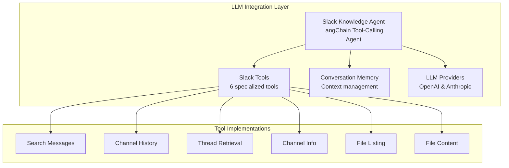
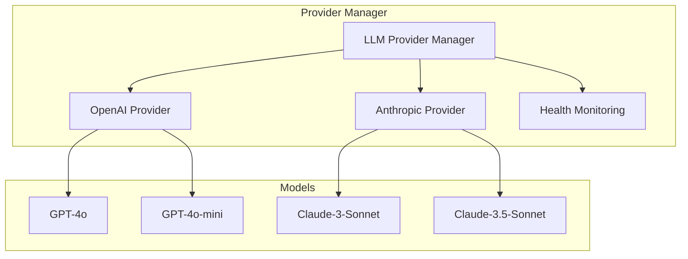
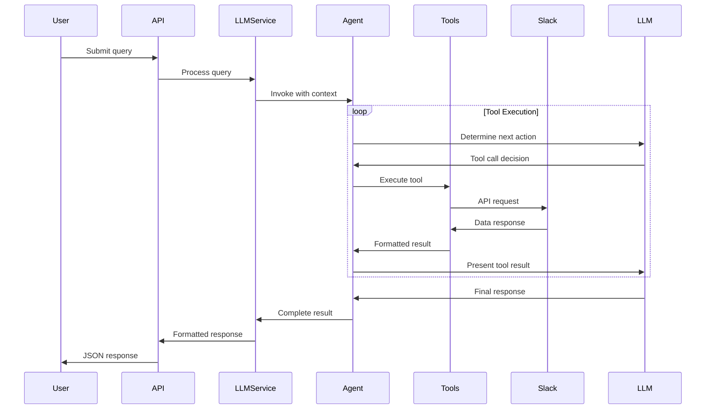

# LLM Integration Documentation

This document provides comprehensive information about the Large Language Model (LLM) integration in the Slack Knowledge Agent, including LangChain agents, tool architecture, and provider management.

## Overview

The LLM integration is built on LangChain framework and implements a tool-calling agent pattern that allows AI models to intelligently interact with Slack data through specialized tools.

### Key Components



## Agent Architecture

### Slack Knowledge Agent

**File**: `src/llm/agents/SlackKnowledgeAgent.ts`

The `SlackKnowledgeAgent` is the core AI component that processes user queries and uses tools to retrieve information from Slack.

#### Key Features
- **Tool-Calling Pattern**: Uses LangChain's tool-calling agent for reliable tool execution
- **Memory Management**: Maintains conversation context across interactions
- **Streaming Support**: Supports both regular and streaming responses
- **Error Handling**: Robust error handling with fallback strategies
- **Context Formatting**: Intelligent formatting of channel and context information

#### Agent Configuration

```typescript
interface AgentConfig {
  maxIterations?: number;          // Maximum tool execution iterations (default: 15)
  verbose?: boolean;               // Enable debug logging (default: false)
  returnIntermediateSteps?: boolean; // Include tool execution steps (default: true)
  handleParsingErrors?: boolean;   // Handle LLM parsing errors gracefully (default: true)
  memory?: SlackConversationMemory; // Conversation memory instance
}
```

#### Agent Initialization

```typescript
export class SlackKnowledgeAgent {
  async initialize(): Promise<void> {
    // Create prompt template with system instructions
    const systemMessage = `You are a Slack Knowledge Agent...`;
    
    // Build message template with conditional memory
    const messagesList = [
      ['system', systemMessage],
      ...(this.memory ? [new MessagesPlaceholder('chat_history')] : []),
      ['human', '{input}'],
      new MessagesPlaceholder('agent_scratchpad')
    ];
    
    const prompt = ChatPromptTemplate.fromMessages(messagesList);
    
    // Create tool-calling agent
    const agent = await createToolCallingAgent({
      llm: this.model,
      tools: this.tools,
      prompt
    });
    
    // Create agent executor
    this.agent = new AgentExecutor({
      agent,
      tools: this.tools,
      verbose: this.config.verbose,
      maxIterations: this.config.maxIterations,
      returnIntermediateSteps: this.config.returnIntermediateSteps,
      handleParsingErrors: this.config.handleParsingErrors,
      memory: this.memory
    });
  }
}
```

### System Prompt Design

The agent uses a carefully crafted system prompt that:
- Defines the agent's role and capabilities
- Lists available tools with usage instructions
- Provides parameter format specifications
- Emphasizes proper tool usage patterns

```typescript
const systemMessage = `You are a Slack Knowledge Agent that helps users find information from their Slack workspace.

Available channels to search:
{channels}

You have access to the following tools:

- get_channel_info: Get information about a Slack channel (requires: channel_id)
- get_channel_history: Get recent messages from a specific Slack channel (requires: channel_id)  
- search_messages: Search for messages across Slack channels (requires: query, channels array)
- get_thread: Get all messages in a specific thread (requires: channel_id, thread_ts)
- list_files: List files shared in Slack channels (requires: channels array)
- get_file_content: Get the content of a text file from Slack (requires: file_id)

IMPORTANT: 
- Always use the exact parameter names and formats specified in the tool schemas
- For channel parameters: use channel IDs (not channel names)
- For search_messages: pass channels as an array, e.g., ["C09B8CNEQNR"] 
- For single channel tools: use channel_id as a string

Always use tools to gather information before responding. If you find relevant information, quote it with context (user and timestamp).`;
```

## Tool System

### Tool Architecture

The tool system provides the agent with capabilities to interact with Slack data. Each tool is implemented with:
- **Zod Schema Validation**: Runtime parameter validation
- **Error Handling**: Specific error handling for different failure modes
- **Result Formatting**: Consistent result structure for the agent

### Available Tools

#### 1. Search Messages Tool

**Purpose**: Search for messages across multiple Slack channels
**Use Cases**: Finding discussions about specific topics, keywords, or phrases

```typescript
// Tool definition
{
  name: 'search_messages',
  description: 'Search for messages across Slack channels. Use this to find information mentioned in conversations.',
  parameters: {
    query: { type: 'string', description: 'Search query string. Use keywords, phrases, or specific terms.' },
    channels: { type: 'array', items: { type: 'string' }, description: 'Array of channel IDs or names to search in.' },
    limit: { type: 'number', description: 'Maximum number of results (1-100, default: 20)' },
    days_back: { type: 'number', description: 'Search messages from this many days back (optional, 1-365 days)' }
  },
  required: ['query', 'channels']
}
```

**Example Usage**:
```json
{
  "query": "deployment issues production",
  "channels": ["C1234567890", "C0987654321"],
  "limit": 20,
  "days_back": 7
}
```

#### 2. Get Channel History Tool

**Purpose**: Retrieve recent messages from a specific channel
**Use Cases**: Understanding recent activity, getting channel context

```typescript
// Tool definition
{
  name: 'get_channel_history',
  description: 'Get recent messages from a specific Slack channel. Use this to understand recent conversations or context.',
  parameters: {
    channel_id: { type: 'string', description: 'Channel ID or name (without # symbol)' },
    limit: { type: 'number', description: 'Maximum number of messages to retrieve (1-200, default: 50)' },
    include_threads: { type: 'boolean', description: 'Whether to include thread replies (default: false)' }
  },
  required: ['channel_id']
}
```

#### 3. Get Thread Tool

**Purpose**: Retrieve all messages in a specific thread
**Use Cases**: Understanding threaded conversations, getting full context of discussions

```typescript
{
  name: 'get_thread',
  description: 'Get all messages in a specific thread. Use this when you need to see the full context of a threaded conversation.',
  parameters: {
    channel_id: { type: 'string', description: 'Channel ID or name where the thread exists' },
    thread_ts: { type: 'string', description: 'Timestamp of the parent message that started the thread' }
  },
  required: ['channel_id', 'thread_ts']
}
```

#### 4. Get Channel Info Tool

**Purpose**: Get metadata about a Slack channel
**Use Cases**: Understanding channel purpose, member count, topics

```typescript
{
  name: 'get_channel_info',
  description: 'Get information about a Slack channel including its purpose, topic, and member count.',
  parameters: {
    channel_id: { type: 'string', description: 'Channel ID or name (without # symbol)' }
  },
  required: ['channel_id']
}
```

#### 5. List Files Tool

**Purpose**: Find files shared in Slack channels
**Use Cases**: Locating documents, images, or other shared resources

```typescript
{
  name: 'list_files',
  description: 'List files shared in Slack channels. Use this to find documents, images, or other files mentioned in conversations.',
  parameters: {
    channels: { type: 'array', items: { type: 'string' }, description: 'Array of channel IDs or names to search for files' },
    file_types: { type: 'array', items: { type: 'string' }, description: 'Filter by file types (e.g., ["pdf", "txt", "doc", "png", "jpg"])' },
    limit: { type: 'number', description: 'Maximum number of files to return (1-100, default: 20)' }
  },
  required: ['channels']
}
```

#### 6. Get File Content Tool

**Purpose**: Read the content of text-based files
**Use Cases**: Analyzing documents, reading code files, extracting text content

```typescript
{
  name: 'get_file_content',
  description: 'Get the content of a text file from Slack. Use this to read documents, code files, or other text-based files.',
  parameters: {
    file_id: { type: 'string', description: 'File ID from Slack (obtained from list_files)' }
  },
  required: ['file_id']
}
```

### Tool Implementation Pattern

Each tool follows a consistent implementation pattern:

```typescript
export class SlackTools {
  // Schema definition for validation
  private searchMessagesSchema = z.object({
    query: z.string().min(1).describe('Search query string'),
    channels: z.array(z.string()).min(1).describe('Array of channel IDs or names'),
    limit: z.number().int().min(1).max(100).default(20),
    days_back: z.number().int().min(1).max(365).optional()
  });

  // Tool definition for LangChain
  getSearchMessagesTool() {
    return {
      definition: {
        type: 'function',
        function: {
          name: 'search_messages',
          description: '...',
          parameters: { /* JSON schema */ }
        }
      },
      handler: this.searchMessages.bind(this)
    };
  }

  // Tool implementation
  private async searchMessages(params: any): Promise<ToolExecutionResult> {
    try {
      // Validate parameters
      const validatedParams = this.searchMessagesSchema.parse(params);
      
      // Execute operation
      const result = await this.slackService.searchMessages(validatedParams);
      
      // Return formatted result
      return {
        success: true,
        data: {
          messages: result.messages.map(msg => ({
            channel: msg.channel,
            user: msg.user,
            text: msg.text,
            timestamp: msg.ts,
            thread_ts: msg.thread_ts
          })),
          metadata: result.metadata
        }
      };
    } catch (error) {
      // Handle specific errors with helpful messages
      return {
        success: false,
        error: this.formatErrorMessage(error)
      };
    }
  }
}
```

## LLM Provider Management

### Provider Architecture



### Supported Providers

#### OpenAI Provider
**File**: `src/llm/models/OpenAILLM.ts`

- **Models**: GPT-3.5-Turbo, GPT-4, GPT-4o, GPT-4o-mini
- **Features**: Function calling, streaming, embeddings
- **Configuration**: API key, model selection, temperature, max tokens

```typescript
interface OpenAIConfig {
  apiKey: string;
  model: string;
  temperature: number;
  maxTokens: number;
  timeout: number;
}
```

#### Anthropic Provider
**File**: `src/llm/models/AnthropicLLM.ts`

- **Models**: Claude-3-Haiku, Claude-3-Sonnet, Claude-3-Opus, Claude-3.5-Sonnet
- **Features**: Tool calling, streaming, long context
- **Configuration**: API key, model selection, temperature, max tokens

```typescript
interface AnthropicConfig {
  apiKey: string;
  model: string;
  temperature: number;
  maxTokens: number;
  timeout: number;
}
```

### Provider Switching

The system supports runtime provider switching:

```typescript
// Switch to different provider
llmService.setProvider('anthropic');

// Get available providers
const providers = llmService.getAvailableProviders(); // ['openai', 'anthropic']

// Get models for a provider
const models = await llmService.getProviderModels('openai');
```

## Memory System

### Conversation Memory

**File**: `src/llm/memory/SlackMemory.ts`

The memory system maintains conversation context across interactions:

#### Features
- **Message History**: Keeps track of conversation flow
- **Token Management**: Limits memory to prevent context overflow
- **Smart Truncation**: Removes old messages while preserving important context
- **Session Management**: Per-user/channel memory isolation

#### Implementation
```typescript
export class SlackConversationMemory extends ConversationSummaryBufferMemory {
  constructor(config: MemoryConfig) {
    super({
      llm: config.llm,
      maxTokenLimit: config.maxTokens,  // Default: 2000 tokens
      returnMessages: true,
      memoryKey: 'chat_history',
      inputKey: 'input',
      outputKey: 'output'
    });
  }

  // Add custom context to memory
  async addContext(context: ConversationContext): Promise<void> {
    if (context.channelInfo) {
      await this.saveContext(
        { input: `Channel context: ${context.channelInfo}` },
        { output: 'Context noted.' }
      );
    }
  }

  // Clear memory for new conversation
  async clear(): Promise<void> {
    await super.clear();
    this.logger.info('Conversation memory cleared');
  }
}
```

## Query Processing Pipeline

### Processing Flow



### Context Building

Before invoking the agent, the system builds rich context:

```typescript
interface LLMContext {
  query: string;                    // User's question
  channelIds: string[];            // Selected channels
  userId?: string;                 // User ID for personalization
  metadata: {
    channels?: ChannelInfo[];      // Channel metadata
    includeFiles?: boolean;        // Whether to include file search
    includeThreads?: boolean;      // Whether to include thread context
    timeRange?: DateRange;         // Time range for searches
  };
}
```

### Response Formatting

The system provides structured responses with rich metadata:

```typescript
interface QueryResult {
  response: string;                // AI-generated answer
  usage: TokenUsage;              // Token consumption stats
  provider: LLMProvider;          // Which LLM was used
  model: string;                  // Specific model name
  toolCalls: number;              // Number of tool executions
  intermediateSteps?: any[];      // Tool execution details
  sources?: SourceReference[];    // Source attributions
  processingTime: number;         // Total processing time
}
```

## Streaming Support

The agent supports streaming responses for real-time user experience:

```typescript
// Streaming query execution
async *streamQuery(input: string, context: Record<string, any>) {
  const stream = await this.agent.streamEvents(
    { input, ...context },
    { version: 'v1' }
  );

  for await (const chunk of stream) {
    yield {
      type: chunk.event,
      data: chunk.data,
      timestamp: Date.now()
    };
  }
}
```

## Error Handling

### Tool-Level Error Handling

Each tool provides specific error handling:

```typescript
// Channel access errors
if (errorMessage.includes('not_in_channel')) {
  return {
    success: false,
    error: `Cannot access channel. The bot needs to be invited to this channel by a member. Please ask a channel member to invite the bot using: /invite @your-bot-name`
  };
}

// Search availability errors
if (errorMessage.includes('search_not_available')) {
  return {
    success: false,
    error: `Search functionality requires a paid Slack plan or additional permissions.`
  };
}
```

### Agent-Level Error Handling

The agent handles parsing and execution errors gracefully:

```typescript
const agentExecutor = new AgentExecutor({
  agent,
  tools: this.tools,
  handleParsingErrors: true,  // Handle LLM parsing errors
  maxIterations: 15,          // Prevent infinite loops
  returnIntermediateSteps: true // Include debug info
});
```

## Performance Optimization

### Agent Caching
- Agents are cached per provider/model combination
- Cache invalidation on configuration changes
- Memory-efficient agent reuse

### Token Management
- Context window optimization
- Smart memory truncation
- Token usage tracking and optimization

### Concurrent Processing
- Multiple queries can be processed simultaneously
- Rate limiting to respect API limits
- Queue management for high load

---

*Next: [Slack Integration Documentation](./SLACK.md) for details on Slack API integration*
