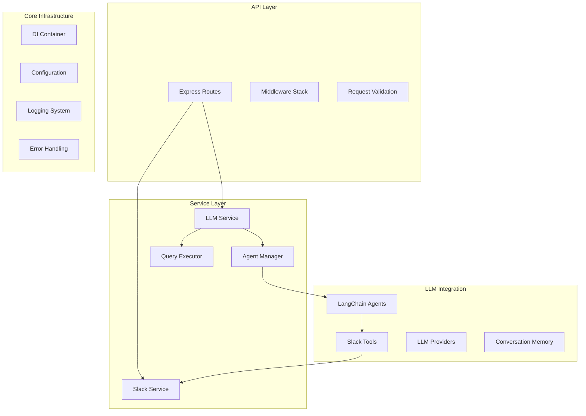

# Backend Documentation

Welcome to the Slack Knowledge Agent backend documentation. This documentation covers the Node.js/TypeScript API server that powers the AI-driven Slack knowledge extraction system.

## Overview

The backend is a modern TypeScript/Node.js application built with Express.js that provides:

- **RESTful API**: Clean API endpoints for frontend communication
- **LLM Integration**: Support for OpenAI and Anthropic language models via LangChain
- **Slack API Integration**: Comprehensive Slack Web API wrapper with specialized tools
- **Agent Architecture**: Tool-calling agents for intelligent information retrieval
- **Dependency Injection**: Clean architecture with IoC container
- **Configuration Management**: Environment-based configuration system
- **Comprehensive Logging**: Structured logging with Winston
- **Health Monitoring**: Detailed health check endpoints

## Architecture



## Documentation Structure

### Core Components
- **[API Documentation](./API.md)** - REST API endpoints and middleware
- **[Services](./SERVICES.md)** - Business logic and service layer architecture
- **[LLM Integration](./LLM.md)** - LangChain agents and LLM provider management
- **[Slack Integration](./SLACK.md)** - Slack API wrapper and tools
- **[Configuration](./CONFIGURATION.md)** - Environment and configuration management
- **[Container](./CONTAINER.md)** - Dependency injection system

### Development
- **[Development Setup](./DEVELOPMENT.md)** - Local development environment
- **[Testing](./TESTING.md)** - Testing strategies and test execution
- **[Deployment](./DEPLOYMENT.md)** - Production deployment guide
- **[Monitoring](./MONITORING.md)** - Logging, health checks, and observability

### Reference
- **[Error Handling](./ERROR_HANDLING.md)** - Error management patterns
- **[Security](./SECURITY.md)** - Security considerations and best practices
- **[Performance](./PERFORMANCE.md)** - Performance optimization techniques

## Quick Reference

### Project Structure
```
backend/
├── src/
│   ├── api/                 # API routes and middleware
│   │   ├── dto/            # Data transfer objects
│   │   ├── middleware/     # Express middleware
│   │   ├── routes/         # Route handlers
│   │   └── validators/     # Request validation schemas
│   ├── core/               # Core application infrastructure
│   │   ├── app/           # Application lifecycle management
│   │   ├── config/        # Configuration management
│   │   └── container/     # Dependency injection container
│   ├── interfaces/         # Service interfaces and contracts
│   ├── llm/               # LLM integration and agents
│   │   ├── agents/        # LangChain agent implementations
│   │   ├── memory/        # Conversation memory management
│   │   ├── models/        # LLM provider implementations
│   │   ├── prompts/       # System prompts and templates
│   │   └── tools/         # Slack-specific tools
│   ├── services/          # Business logic services
│   ├── utils/             # Shared utilities
│   └── server.ts      # Application entry point
├── tests/                 # Test suites
├── config/               # Configuration files
└── docs/                 # This documentation
```

### Key Technologies

| Technology | Purpose | Version |
|------------|---------|---------|
| **Node.js** | Runtime environment | 20+ |
| **TypeScript** | Type-safe JavaScript | 5.5+ |
| **Express.js** | Web framework | 4.19+ |
| **LangChain** | LLM orchestration | 0.3+ |
| **Slack SDK** | Slack API integration | 7.9+ |
| **Winston** | Structured logging | 3.17+ |
| **Zod** | Runtime validation | 3.23+ |
| **Jest** | Testing framework | 29.7+ |

### Environment Variables

| Variable | Description | Required | Example |
|----------|-------------|----------|---------|
| `NODE_ENV` | Environment mode | ❌ | `development` |
| `PORT` | Server port | ❌ | `3000` |
| `SLACK_BOT_TOKEN` | Slack bot OAuth token | ✅ | `xoxb-...` |
| `SLACK_USER_TOKEN` | Slack user OAuth token | ✅ | `xoxp-...` |
| `SLACK_SIGNING_SECRET` | Slack signing secret | ✅ | `abc123...` |
| `OPENAI_API_KEY` | OpenAI API key | ⚠️ | `sk-...` |
| `ANTHROPIC_API_KEY` | Anthropic API key | ⚠️ | `sk-ant-...` |
| `DEFAULT_LLM_PROVIDER` | Default LLM provider | ✅ | `openai` |

> ⚠️ At least one LLM provider key is required

### API Endpoints Overview

| Endpoint | Method | Purpose |
|----------|--------|---------|
| `/api/health` | GET | System health status |
| `/api/slack/channels` | GET | Available Slack channels |
| `/api/slack/health` | GET | Slack service health |
| `/api/query` | POST | Process AI queries |
| `/api/query/health` | GET | LLM service health |
| `/api/query/providers` | GET | Available LLM providers |

### Common Commands

```bash
# Development
pnpm run dev          # Start development server with hot reload
pnpm run dev:old      # Start with legacy server configuration

# Building
pnpm run build        # Compile TypeScript to JavaScript
pnpm run typecheck    # Type checking without compilation

# Testing
pnpm run test         # Run test suites
pnpm run test:watch   # Run tests in watch mode
pnpm run test:coverage # Generate coverage report

# Code Quality
pnpm run lint         # Run ESLint
pnpm run lint:fix     # Fix ESLint issues automatically
pnpm run format       # Format code with Prettier

# Production
pnpm run start        # Start production server
pnpm run start:old    # Start with legacy configuration

# Integration Testing
pnpm run test:integration  # Test with real Slack/LLM APIs
pnpm run test:tools        # Test individual tools
```

## Getting Started

### 1. Install Dependencies
```bash
cd backend
pnpm install
```

### 2. Configure Environment
```bash
cp .env.example .env
# Edit .env with your configuration
```

### 3. Start Development Server
```bash
pnpm run dev
```

The server will start on `http://localhost:3000` with:
- API endpoints available at `/api/*`
- Health check at `/api/health`
- Automatic restart on file changes

### 4. Verify Setup
```bash
# Check server health
curl http://localhost:3000/api/health

# Check available channels (requires Slack configuration)
curl http://localhost:3000/api/slack/channels

# Test query endpoint (requires both Slack and LLM configuration)
curl -X POST http://localhost:3000/api/query \
  -H "Content-Type: application/json" \
  -d '{"query": "test", "channels": ["general"]}'
```

## Key Concepts

### Dependency Injection Container
The application uses a custom IoC container for service lifecycle management:

```typescript
// Service registration
container.registerSingleton(SERVICE_TOKENS.SLACK_SERVICE, SlackService);

// Service resolution with automatic dependency injection
const slackService = container.resolve<ISlackService>(SERVICE_TOKENS.SLACK_SERVICE);
```

### Tool-Based Agent Architecture
LLM agents use specialized tools to interact with Slack:

```typescript
const tools = [
  searchMessagesTool,      // Search messages across channels
  getChannelHistoryTool,   // Get recent channel messages
  getThreadTool,          // Retrieve thread conversations
  getChannelInfoTool,     // Get channel metadata
  listFilesTool,          // Find shared files
  getFileContentTool      // Read file contents
];
```

### Service Layer Pattern
Business logic is organized into focused services:

- **LLMService**: Main orchestrator for LLM operations
- **SlackService**: Abstraction layer for Slack Web API
- **AgentManager**: LangChain agent lifecycle management
- **QueryExecutor**: Query processing pipeline

### Error Handling Strategy
Multi-layer error handling ensures robust operation:

1. **Tool Level**: Specific error handling for Slack API issues
2. **Service Level**: Business logic error management
3. **API Level**: HTTP error responses and logging
4. **Global Level**: Unhandled error capturing and reporting

## Next Steps

- **[API Documentation](./API.md)**: Learn about the REST API endpoints
- **[Services Documentation](./SERVICES.md)**: Understand the service layer architecture
- **[LLM Integration](./LLM.md)**: Deep dive into the AI agent implementation
- **[Development Setup](./DEVELOPMENT.md)**: Set up your local development environment

---

*For frontend integration details, see the [Frontend Documentation](../../frontend/docs/README.md)*
