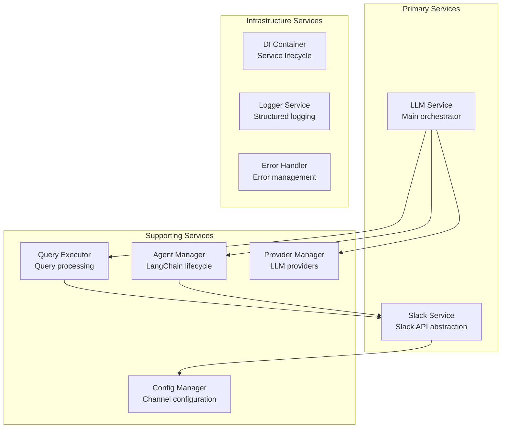
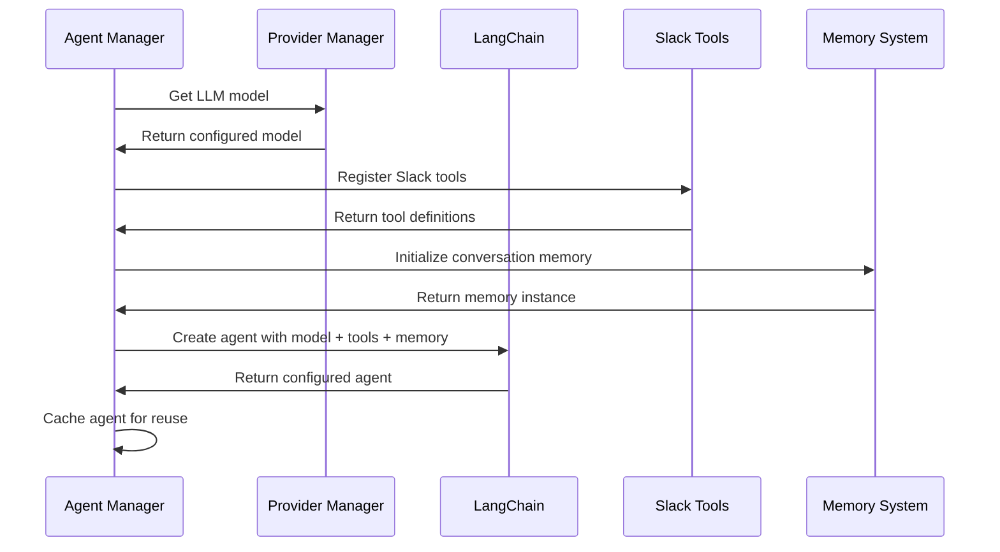
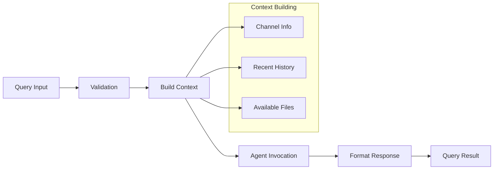

# Services Documentation

This document provides detailed information about the service layer architecture and individual service implementations in the Slack Knowledge Agent backend.

## Service Layer Architecture

The backend follows a service-oriented architecture where business logic is encapsulated in focused, single-responsibility services. These services are managed through dependency injection and provide clean interfaces for different aspects of the application.

### Service Hierarchy



## Core Services

### LLM Service

**File**: `src/services/LLMService.ts`

**Purpose**: Main orchestration service for all LLM-related operations, coordinating between provider management, agent lifecycle, and query execution.

#### Responsibilities
- Query processing coordination
- LLM provider management
- Agent lifecycle management
- Memory management
- Health status monitoring
- Service initialization and cleanup

#### Key Methods

```typescript
interface ILLMService {
  // Initialization
  initialize(): Promise<void>;
  dispose(): Promise<void>;
  
  // Query processing
  processQuery(context: LLMContext, config?: Partial<LLMConfig>): Promise<QueryResult>;
  streamQuery(context: LLMContext, config?: Partial<LLMConfig>): AsyncIterable<StreamChunk>;
  
  // Provider management
  setProvider(provider: LLMProvider): void;
  getAvailableProviders(): LLMProvider[];
  getCurrentProvider(): LLMProvider;
  
  // Health and stats
  getHealthStatus(): HealthStatus;
  getStats(): ServiceStats;
  clearMemory(): Promise<void>;
}
```

#### Usage Example
```typescript
const llmService = container.resolve<ILLMService>(SERVICE_TOKENS.LLM_SERVICE);

// Initialize service
await llmService.initialize();

// Process a query
const result = await llmService.processQuery({
  query: "What did the team discuss about the new feature?",
  channelIds: ["C1234567890"],
  userId: "U0987654321",
  metadata: { includeFiles: true }
});

console.log(result.response); // AI-generated response
console.log(result.usage);    // Token usage statistics
```

#### Configuration
```typescript
interface LLMServiceConfig {
  provider: LLMProviderConfig;
  executor: QueryExecutorConfig;
  agent: AgentConfig;
}

// Example configuration
const config: LLMServiceConfig = {
  provider: {
    openaiApiKey: process.env.OPENAI_API_KEY,
    anthropicApiKey: process.env.ANTHROPIC_API_KEY,
    defaultProvider: 'openai',
    defaultModel: 'gpt-4o-mini'
  },
  executor: {
    maxConcurrentQueries: 10,
    queryTimeoutMs: 30000
  },
  agent: {
    maxIterations: 15,
    verbose: true,
    memoryEnabled: true
  }
};
```

### Slack Service

**File**: `src/services/SlackService.ts`

**Purpose**: Abstraction layer for Slack Web API operations, providing a clean interface for all Slack-related functionality.

#### Responsibilities
- Slack API client management
- Channel information retrieval
- Message search operations
- File operations
- Thread management
- Error handling and rate limiting

#### Key Methods

```typescript
interface ISlackService {
  // Channel operations
  getChannels(): Promise<Channel[]>;
  getChannelById(channelId: string): Promise<Channel | null>;
  getChannelByName(channelName: string): Promise<Channel | null>;
  getChannelHistory(channelId: string, options?: HistoryOptions): Promise<HistoryResult>;
  
  // Search operations
  searchMessages(params: SearchParams): Promise<SearchResult>;
  
  // File operations
  getFiles(params: FileListParams): Promise<FileListResult>;
  getFileContent(fileId: string): Promise<string>;
  
  // Health and monitoring
  getHealthStatus(): Promise<HealthStatus>;
  testConnection(): Promise<boolean>;
}
```

#### Usage Example
```typescript
const slackService = container.resolve<ISlackService>(SERVICE_TOKENS.SLACK_SERVICE);

// Get all channels
const channels = await slackService.getChannels();

// Search messages
const searchResult = await slackService.searchMessages({
  query: "deployment issues",
  channels: ["engineering", "ops"],
  limit: 20,
  time_range: {
    start: new Date(Date.now() - 7 * 24 * 60 * 60 * 1000), // 7 days ago
    end: new Date()
  }
});

// Get channel history
const history = await slackService.getChannelHistory("C1234567890", {
  limit: 50,
  includeThreads: true
});
```

#### Error Handling
The Slack service provides comprehensive error handling for common API issues:

```typescript
// Channel access errors
if (error.code === 'not_in_channel') {
  throw new SlackError(
    `Bot needs to be invited to channel ${channelId}`,
    'CHANNEL_ACCESS_DENIED',
    { channelId, suggestion: 'Invite bot using /invite @bot-name' }
  );
}

// Rate limiting
if (error.code === 'rate_limited') {
  await this.handleRateLimit(error.retryAfter);
  return this.retryOperation(operation, params);
}
```

### Agent Manager

**File**: `src/services/AgentManager.ts`

**Purpose**: Manages LangChain agent lifecycle, including creation, caching, and memory management.

#### Responsibilities
- Agent creation and initialization
- Agent caching and reuse
- Tool registration and management
- Memory system management
- Context formatting and handling

#### Key Features

```typescript
interface AgentManager {
  // Agent lifecycle
  initialize(): Promise<void>;
  getAgent(provider?: LLMProvider, model?: string): Promise<SlackKnowledgeAgent>;
  refreshAgent(provider?: LLMProvider, model?: string): void;
  
  // Memory management
  clearMemory(): Promise<void>;
  getMemoryStats(): Promise<MemoryStats>;
  
  // Statistics
  getStats(): AgentStats;
}
```

#### Agent Creation Process


### Query Executor

**File**: `src/services/QueryExecutor.ts`

**Purpose**: Handles the query processing pipeline, including validation, context building, and agent invocation.

#### Responsibilities
- Query validation and sanitization
- Context building from channel information
- Agent invocation and result processing
- Response formatting and metadata collection
- Concurrent query management

#### Processing Pipeline



#### Usage Example
```typescript
const queryExecutor = new QueryExecutor(providerManager, agentManager, slackService, config);

const result = await queryExecutor.executeQuery(
  {
    query: "What are the deployment best practices discussed recently?",
    channelIds: ["C1234567890", "C0987654321"],
    userId: "U1122334455",
    metadata: { includeFiles: true, includeThreads: true }
  },
  { provider: 'openai', model: 'gpt-4o-mini' }
);
```

## Supporting Services

### LLM Provider Manager

**File**: `src/services/LLMProviderManager.ts`

**Purpose**: Manages multiple LLM providers (OpenAI, Anthropic) and handles provider switching.

#### Features
- Provider initialization and health checking
- Dynamic provider switching
- Model availability checking
- Usage tracking and rate limiting
- Provider-specific configuration management

### Configuration Manager

**File**: `src/core/config/ConfigManager.ts`

**Purpose**: Manages channel-specific configuration and metadata.

#### Features
- Channel configuration loading
- Dynamic configuration updates
- Configuration validation
- Metadata enrichment for AI context

## Service Registration and Dependency Injection

### Container Registration
All services are registered in the dependency injection container during application startup:

```typescript
// In ApplicationFactory.registerServices()

// Register configuration
container.registerInstance(SERVICE_TOKENS.APP_CONFIG, appConfig);

// Register Slack services
container.registerFactory(SERVICE_TOKENS.SLACK_API_CLIENT, () => 
  new SlackApiClient(slackConfig)
);
container.registerFactory(SERVICE_TOKENS.SLACK_SERVICE, () => 
  new SlackService(container.resolve(SERVICE_TOKENS.SLACK_API_CLIENT))
);

// Register LLM services  
container.registerFactory(SERVICE_TOKENS.LLM_SERVICE, () => 
  new LLMService(
    container.resolve(SERVICE_TOKENS.SLACK_SERVICE),
    llmConfig
  )
);
```

### Service Tokens
Service tokens provide type-safe service resolution:

```typescript
export const SERVICE_TOKENS = {
  // Configuration
  APP_CONFIG: Symbol.for('AppConfig'),
  CHANNEL_CONFIG_MANAGER: Symbol.for('ConfigManager'),
  
  // Slack services
  SLACK_API_CLIENT: Symbol.for('SlackApiClient'),
  SLACK_SERVICE: Symbol.for('SlackService'),
  
  // LLM services
  LLM_SERVICE: Symbol.for('LLMService'),
} as const;
```

## Service Lifecycle Management

### Initialization Order
Services are initialized in dependency order during application startup:

1. **Configuration Services**: App configuration and channel config manager
2. **Slack Services**: API client and Slack service
3. **LLM Services**: Provider manager, agent manager, query executor, LLM service

### Eager vs Lazy Initialization
```typescript
// Eager services (initialized at startup)
const eagerServices = [
  SERVICE_TOKENS.SLACK_API_CLIENT,
  SERVICE_TOKENS.SLACK_SERVICE,
  SERVICE_TOKENS.LLM_SERVICE,
];

// Lazy services (initialized on first use)
const lazyServices = [
  SERVICE_TOKENS.CHANNEL_CONFIG_MANAGER,
];
```

### Cleanup and Disposal
Services implement the `IDisposableService` interface for proper cleanup:

```typescript
interface IDisposableService {
  dispose(): Promise<void>;
}

// Automatic cleanup during application shutdown
await container.dispose(); // Disposes all disposable services
```

## Error Handling in Services

### Service-Level Error Handling
Each service implements comprehensive error handling:

```typescript
export class SlackService implements ISlackService {
  async searchMessages(params: SearchParams): Promise<SearchResult> {
    try {
      const result = await this.client.search.messages(params);
      return this.formatSearchResult(result);
    } catch (error) {
      // Transform Slack API errors to application errors
      throw this.handleSlackError(error, 'searchMessages', params);
    }
  }
  
  private handleSlackError(error: any, operation: string, params?: any): Error {
    if (error.code === 'not_in_channel') {
      return new SlackError(
        'Bot needs to be invited to the channel',
        'CHANNEL_ACCESS_DENIED',
        { operation, params }
      );
    }
    // ... other error mappings
  }
}
```

### Cross-Service Error Propagation
Errors are properly propagated up the service chain with context:

```typescript
// In LLMService
try {
  const result = await this.queryExecutor.executeQuery(context, config);
  return result;
} catch (error) {
  this.logger.error('Query execution failed', error, {
    query: context.query.substring(0, 100),
    channels: context.channelIds
  });
  throw new LLMError(
    'Failed to process query',
    'QUERY_EXECUTION_FAILED',
    { originalError: error, context }
  );
}
```

## Performance Considerations

### Service Caching
- **Agent Caching**: Agents are cached per provider/model combination
- **Channel Caching**: Channel information is cached with TTL
- **Configuration Caching**: Configuration is cached and refreshed periodically

### Connection Pooling
- **HTTP Connections**: Reused connections to external APIs
- **Singleton Services**: Core services use singleton pattern for efficiency

### Memory Management
- **Conversation Memory**: Limited memory window to prevent memory leaks
- **Agent Disposal**: Proper cleanup of agent resources
- **Event Listener Cleanup**: Removal of event listeners during service disposal

---

*Next: [LLM Integration Documentation](./LLM.md) for details on AI agent implementation*
