# Architecture Guide

This document provides a comprehensive overview of the Slack Knowledge Agent architecture, design patterns, and technical implementation details.

## System Architecture

### High-Level Architecture

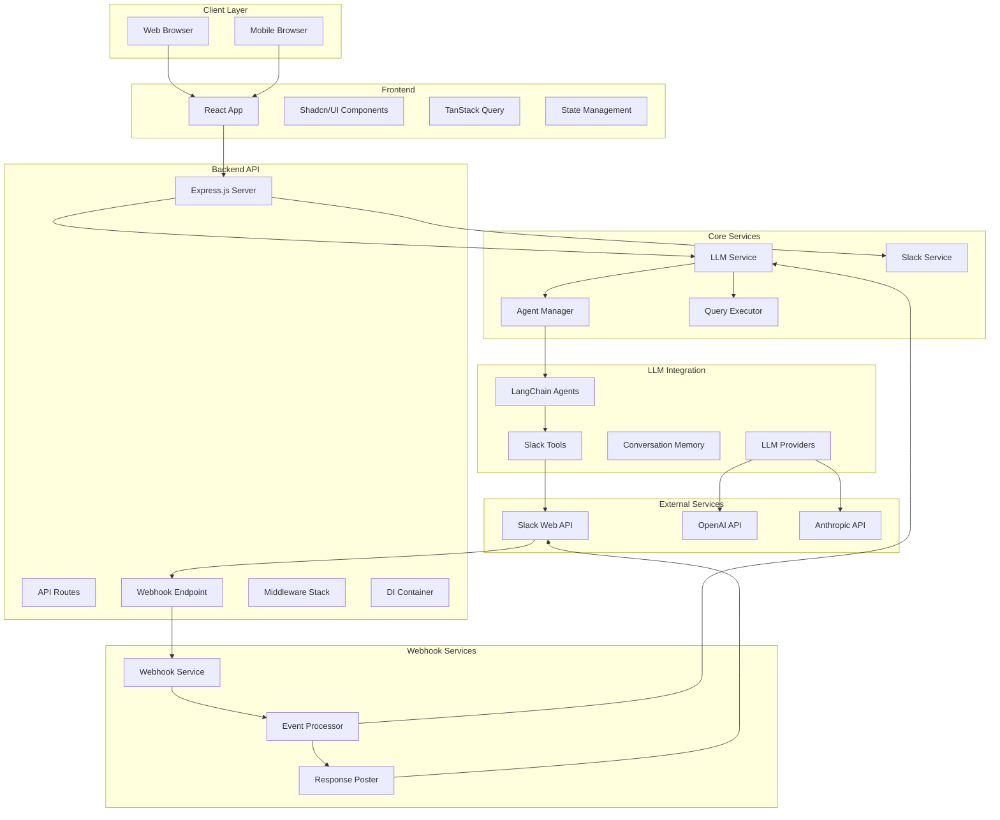

## Backend Architecture

### Core Design Patterns

#### 1. Dependency Injection Container
The application uses a custom dependency injection container for service management:

```typescript
// Service registration
container.registerSingleton(SERVICE_TOKENS.SLACK_SERVICE, SlackService);
container.registerFactory(SERVICE_TOKENS.LLM_SERVICE, () => new LLMService(...));

// Service resolution
const slackService = container.resolve<ISlackService>(SERVICE_TOKENS.SLACK_SERVICE);
```

**Benefits:**
- Loose coupling between components
- Easy testing with mock services
- Lifecycle management (singleton, transient, scoped)
- Circular dependency detection

#### 2. Application Factory Pattern
The `ApplicationFactory` creates fully configured application instances:

```typescript
export class ApplicationFactory {
  async createApplication(options: ApplicationFactoryOptions): Promise<Application> {
    // Validate configuration
    // Create container
    // Register services
    // Setup middleware
    // Initialize routes
    // Configure error handling
  }
}
```

**Benefits:**
- Consistent application setup
- Environment-specific configuration
- Testable application creation
- Clear separation of concerns

#### 3. Service Layer Architecture

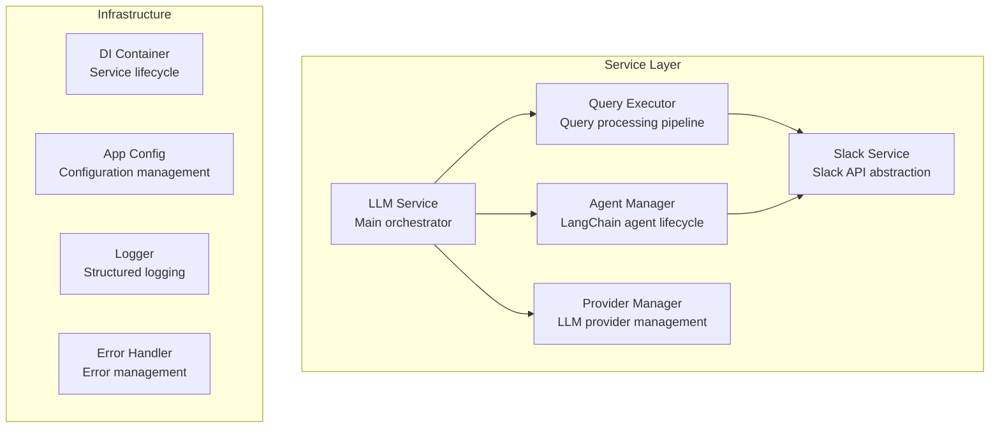

### Service Descriptions

#### LLM Service
**Purpose**: Main orchestration service for LLM operations
**Responsibilities**:
- Query processing coordination
- Provider management
- Session and memory management
- Conversation history synchronization
- Health monitoring

#### Slack Service  
**Purpose**: Abstraction layer for Slack Web API
**Responsibilities**:
- Channel management
- Message searching
- File operations
- Thread retrieval

#### Agent Manager
**Purpose**: LangChain agent lifecycle management
**Responsibilities**:
- Agent creation and caching
- Tool registration
- Memory management
- Context formatting

#### Query Executor
**Purpose**: Query processing pipeline
**Responsibilities**:
- Query validation
- Context building
- Agent invocation
- Response formatting

### Tool-Based Architecture

The system uses a tool-based architecture where the LLM agent has access to specialized tools:

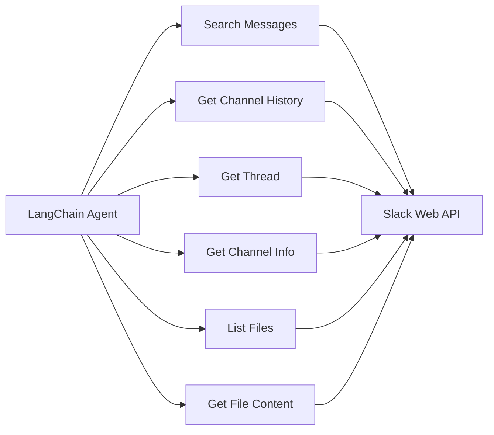

#### Available Tools

| Tool | Purpose | Parameters |
|------|---------|------------|
| `search_messages` | Search for messages across channels | query, channels, limit, days_back |
| `get_channel_history` | Get recent messages from a channel | channel_id, limit, include_threads |
| `get_thread` | Get all messages in a thread | channel_id, thread_ts |
| `get_channel_info` | Get channel metadata | channel_id |
| `list_files` | List files shared in channels | channels, file_types, limit |
| `get_file_content` | Get content of text files | file_id |

### Memory and Session Architecture

The system implements sophisticated conversation memory management to maintain context across user interactions:

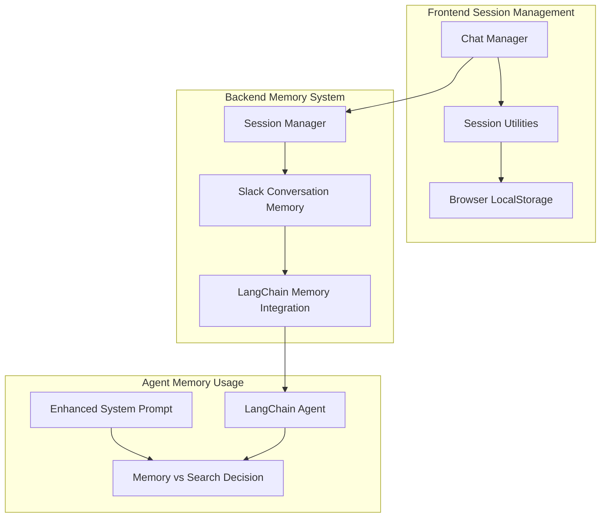

#### Memory Components

##### Session Manager
**Purpose**: Manages isolated conversation sessions with automatic cleanup
**Features**:
- Session-based memory isolation using unique session IDs
- Automatic session expiration (configurable TTL)
- Memory usage tracking and optimization
- LRU cache eviction for resource management

##### Slack Conversation Memory
**Purpose**: LangChain-compatible memory implementation for conversation history
**Features**:
- Frontend history synchronization
- Token and message count limits
- Automatic memory compression when approaching limits
- Context-aware conversation summaries

##### Intelligent Memory Decision Making
**Purpose**: Smart routing between memory and Slack search based on query type
**Logic**:
- **Conversation queries** ("what did I ask before?") → Use memory directly
- **Workspace queries** ("find files about project X") → Use Slack search tools  
- **Mixed queries** → Use both memory and search as appropriate

#### Memory Flow

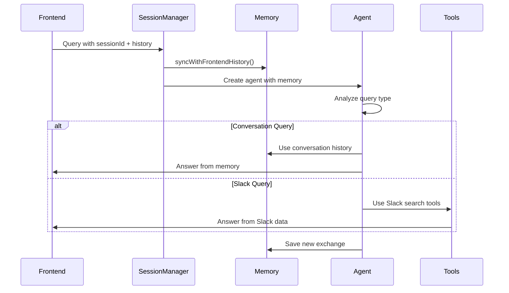

#### Configuration Options

| Setting | Purpose | Default |
|---------|---------|---------|
| `sessionTTLMinutes` | Session expiration time | 120 minutes |
| `memoryMaxMessages` | Max messages per session | 20 |
| `memoryMaxTokens` | Max tokens per session | 2000 |
| `maxSessions` | Global session limit | 100 |
| `compressionEnabled` | Auto-compress old messages | true |

### Webhook Architecture

The system includes a real-time webhook integration that allows the bot to respond to Slack events:

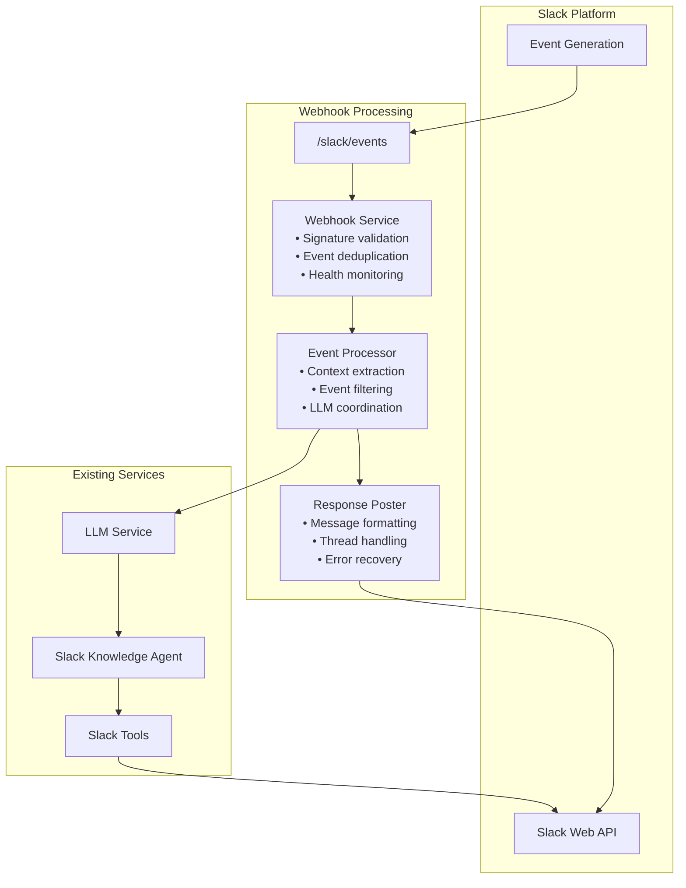

#### Webhook Service Components

##### WebhookService
**Purpose**: Main webhook orchestration and security
**Responsibilities**:
- HMAC-SHA256 signature validation
- Event deduplication using TTL-based cache
- Processing timeout management
- Health status monitoring
- Statistics tracking

##### EventProcessor
**Purpose**: Slack event processing and LLM coordination
**Responsibilities**:
- Event type filtering (app mentions, DMs)
- Context extraction from Slack events
- User and channel information resolution
- LLM context preparation
- Response coordination

##### ResponsePoster
**Purpose**: Post AI responses back to Slack
**Responsibilities**:
- Slack message formatting (markdown, mentions)
- Thread handling for conversational continuity
- Message length management and truncation
- Error handling with user notification
- Direct message support

#### Event Flow

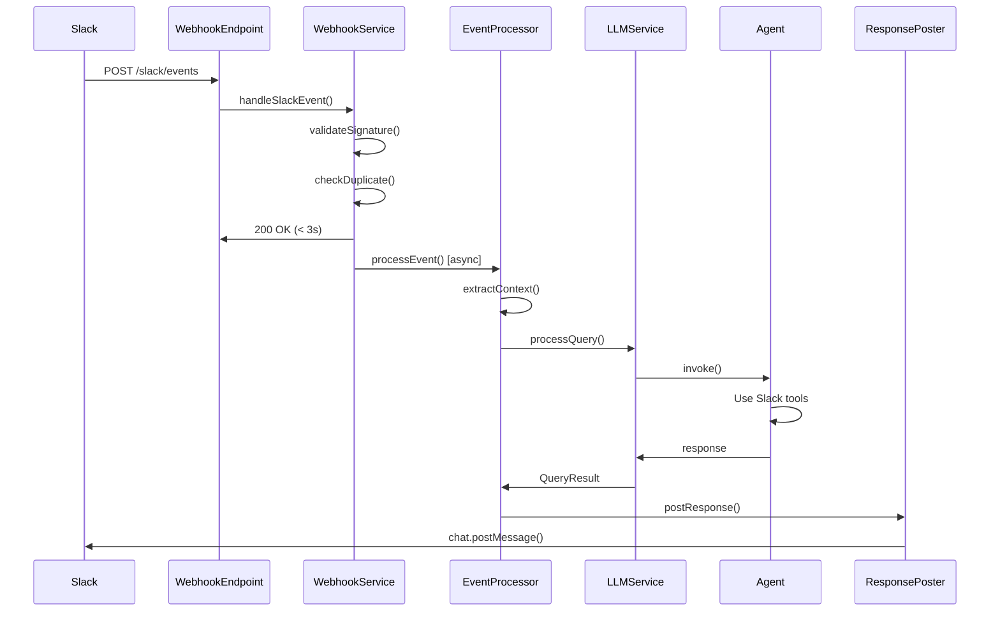

#### Security Features

- **Signature Validation**: HMAC-SHA256 verification of all incoming webhooks
- **Timestamp Validation**: Prevents replay attacks (5-minute window)
- **Event Deduplication**: Prevents processing of duplicate events
- **Input Sanitization**: All event data is validated and sanitized
- **Rate Limiting**: Built-in protection against event flooding

### Configuration Management

#### Hierarchical Configuration System
```typescript
interface AppConfiguration {
  server: ServerConfig;
  slack: SlackConfig;
  llm: LLMConfig;
  query: QueryConfig;
  logging: LoggingConfig;
  security: SecurityConfig;
  webhook: WebhookConfig;
}
```

#### Environment-Based Configuration
- **Development**: Defaults for local development
- **Production**: Security-focused settings
- **Test**: Isolated test environment settings

#### Validation Pipeline
1. **Schema Validation**: Zod schema validation for type safety
2. **Business Logic Validation**: Custom validation rules
3. **Cross-Field Validation**: Ensures configuration consistency

## Frontend Architecture

### Component Architecture

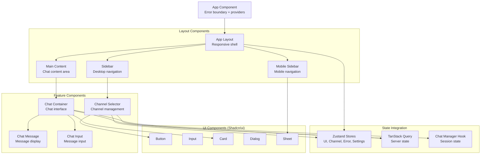

### State Management Strategy

#### Server State (TanStack Query)
- **API Data**: Channels, health status, query responses
- **Caching**: Automatic caching with configurable TTL
- **Background Updates**: Keep data fresh with background refetching
- **Error Handling**: Integrated error handling and retry logic

#### Client State (Zustand Stores)
- **UI Store**: Sidebar state, modal visibility, loading states, current view
- **Channel Store**: Selected channels, channel preferences, search history
- **Settings Store**: Theme, chat preferences, notifications, developer settings
- **Error Store**: Centralized error management by category (global, chat, channels, api)
- **Persistence**: Automatic persistence via Zustand middleware for selected state

#### Session State (Custom Hooks)
- **Chat Manager**: Conversation state, message history, session management
- **Local Storage**: Session IDs and conversation continuity

#### State Flow
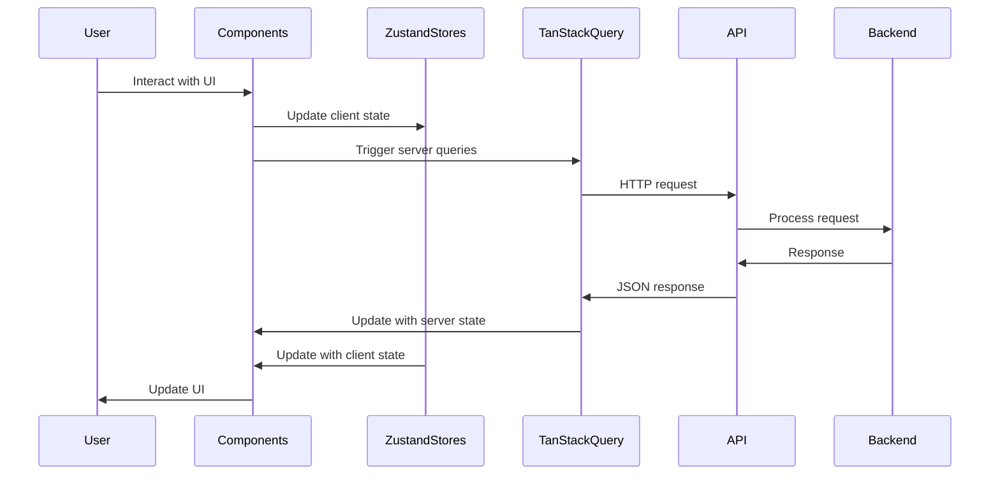

### Component Communication Patterns

#### Props Down, Events Up
- Parent components pass data down via props
- Child components communicate up via callback functions
- Unidirectional data flow for predictability

#### Composition Pattern
```typescript
// Higher-order component for error boundaries
<ErrorBoundary fallback={<ErrorFallback />}>
  <ChatContainer>
    <ChatMessage message={message} />
    <ChatInput onSend={handleSend} />
  </ChatContainer>
</ErrorBoundary>
```

#### Custom Hook Pattern
```typescript
// Encapsulate related logic in custom hooks
const { channels, isLoading, error } = useChannelsQuery();
const { sendMessage, isPending } = useSendMessageMutation();
```

## Data Flow Architecture

### Request Processing Pipeline

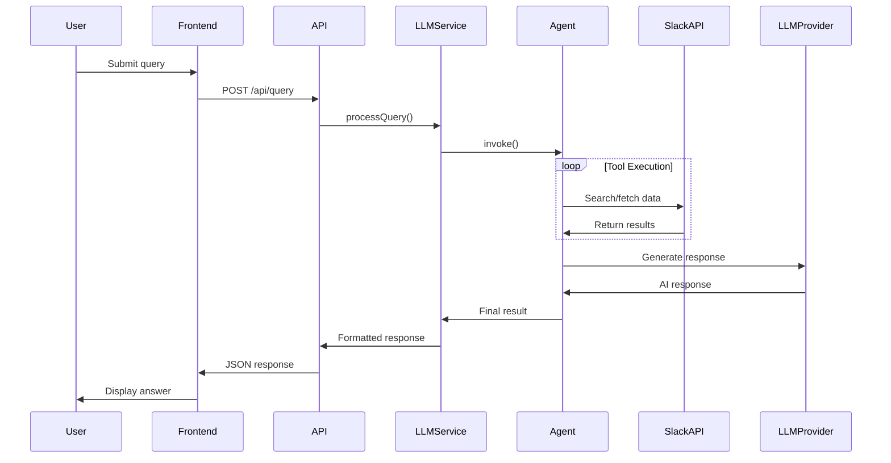

### Error Handling Strategy

#### Multi-Layer Error Handling
1. **Frontend**: User-friendly error messages and fallbacks
2. **API**: Structured error responses with proper HTTP status codes
3. **Service Layer**: Business logic error handling and logging
4. **Tool Layer**: Specific error handling for Slack API issues

#### Error Types and Responses
```typescript
// Slack API errors
if (error.code === 'not_in_channel') {
  return {
    success: false,
    error: 'Bot needs to be invited to this channel'
  };
}

// LLM provider errors  
if (error.type === 'insufficient_quota') {
  return {
    status: 'error',
    message: 'API quota exceeded. Please try again later.'
  };
}
```

## Security Architecture

### Authentication and Authorization Flow
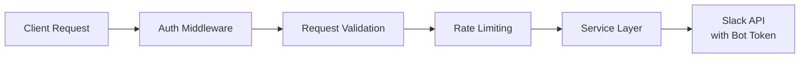

### Security Layers

#### 1. Transport Security
- **HTTPS Only**: All communication over TLS
- **CORS Policy**: Configured allowed origins
- **Headers**: Security headers via Helmet.js

#### 2. Input Validation
- **Schema Validation**: Zod runtime validation
- **Sanitization**: Input sanitization for XSS prevention
- **Rate Limiting**: Request rate limiting per IP

#### 3. API Security
- **Token Management**: Secure storage of API keys
- **Scope Limiting**: Minimal required permissions
- **Request Signing**: Slack webhook signature verification

## Performance Considerations

### Backend Performance
- **Dependency Injection**: Singleton services for efficiency
- **Connection Pooling**: Reused HTTP connections
- **Caching**: Response caching where appropriate
- **Async Processing**: Non-blocking I/O operations

### Frontend Performance
- **Code Splitting**: Lazy loading of components
- **Bundle Optimization**: Tree shaking and minification
- **Caching**: Aggressive caching of API responses
- **Virtual Scrolling**: Efficient rendering of large message lists

### Monitoring and Observability
- **Health Checks**: Comprehensive health monitoring endpoints
- **Structured Logging**: JSON-formatted logs with correlation IDs
- **Metrics**: Performance metrics and usage tracking
- **Error Tracking**: Comprehensive error logging and reporting

---

*For implementation details, see the [Backend Documentation](../backend/docs/README.md) and [Frontend Documentation](../frontend/docs/README.md)*
