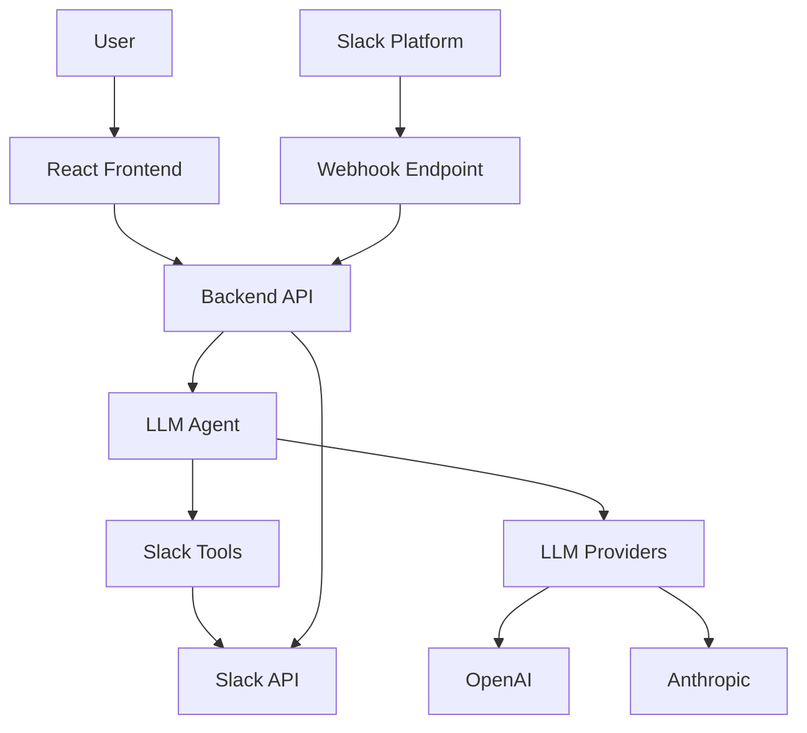

# Project Overview

## What is Slack Knowledge Agent?

Slack Knowledge Agent is an AI-powered service that transforms your Slack workspace into an intelligent knowledge base. It provides a modern chat interface where users can ask natural language questions and receive comprehensive answers based on your Slack workspace data.

## Core Capabilities

### 🔍 Intelligent Search
- **Message Search**: Find information across multiple channels using natural language queries
- **Thread Analysis**: Understand context by analyzing threaded conversations
- **File Discovery**: Locate and analyze documents, images, and other files shared in channels
- **Historical Data**: Search through months of conversation history

### 🤖 AI-Powered Responses
- **Multi-LLM Support**: Choose between OpenAI (GPT models) and Anthropic (Claude models)
- **Context-Aware**: Provides answers with proper context, including user attribution and timestamps
- **Tool Integration**: Uses specialized tools to access different aspects of your Slack data
- **Intelligent Memory System**: Maintains conversation context across sessions, remembers previous questions and discussions for seamless follow-up interactions
- **Real-time Webhooks**: Responds to @mentions in Slack channels instantly
- **Thread Continuity**: Maintains conversations within Slack threads

### 🌐 Modern Web Interface
- **Responsive Design**: Works seamlessly on desktop and mobile devices
- **Channel Selection**: Choose specific channels to search within
- **Real-time Chat**: Interactive chat interface with typing indicators
- **Copy & Export**: Easy copying of conversations and individual messages

## Architecture Overview

### System Components

### Technology Stack

#### Backend
- **Runtime**: Node.js 20+ with TypeScript
- **Framework**: Express.js with modern middleware
- **AI Framework**: LangChain for agent orchestration
- **Architecture**: Dependency injection container pattern
- **APIs**: Comprehensive Slack Web API integration
- **Logging**: Structured logging with Winston
- **Validation**: Zod for runtime type validation

#### Frontend
- **Framework**: React 19 with TypeScript
- **Build Tool**: Vite for fast development and builds
- **Styling**: Tailwind CSS with Shadcn/ui components
- **State Management**: TanStack Query for server state
- **UI Components**: Modern, accessible component library
- **Mobile**: Responsive design with mobile-first approach

#### Infrastructure
- **Containerization**: Docker with multi-stage builds
- **Deployment**: Docker Compose orchestration
- **Monitoring**: Health checks and status endpoints
- **Security**: Helmet.js, CORS, input validation

## Key Features

### For End Users

#### Natural Language Queries
Ask questions in plain English:
- "What did the marketing team discuss about the new product launch?"
- "Find files shared in #engineering about the API documentation"
- "Who mentioned the budget meeting in the last week?"

#### Channel-Specific Search
- Select specific channels to search within
- Persistent channel selection across sessions
- Visual channel organization and management

#### Rich Response Format
- Contextual answers with source attribution
- Timestamps and user information
- Direct links to original Slack messages
- Structured formatting for better readability

### For Administrators

#### Multi-LLM Provider Support
- OpenAI integration (GPT-3.5, GPT-4, GPT-4o)
- Anthropic integration (Claude models)
- Runtime provider switching
- Cost tracking and usage monitoring

#### Comprehensive Configuration
- Environment-based configuration
- Slack workspace integration
- Rate limiting and security controls
- Logging and monitoring setup

#### Deployment Options
- Docker containerization
- Production-ready configuration
- Health monitoring endpoints
- Scalable architecture design

## Use Cases

### 📋 Team Knowledge Management
- **Onboarding**: Help new team members find relevant information
- **Process Documentation**: Extract procedures and best practices from conversations
- **Decision History**: Find past discussions about important decisions
- **Resource Discovery**: Locate shared files, links, and resources
- **In-Channel Assistance**: Get instant answers by mentioning the bot directly in Slack

### 🔄 Cross-Team Communication
- **Project Updates**: Find status updates across multiple project channels
- **Meeting Notes**: Search for meeting summaries and action items
- **Announcements**: Locate company-wide announcements and policy changes
- **Technical Discussions**: Find solutions to technical problems discussed previously

### 📊 Analytics and Insights
- **Team Activity**: Understand communication patterns and active topics
- **Knowledge Gaps**: Identify frequently asked questions that need documentation
- **Resource Usage**: Track what files and links are shared most often
- **Communication Health**: Analyze team collaboration effectiveness

## Benefits

### Efficiency Gains
- **Faster Information Retrieval**: Find answers in seconds instead of scrolling through channels
- **Reduced Interruptions**: Less need to ask colleagues for information directly
- **Context Preservation**: Maintain full context of discussions and decisions
- **Time Savings**: Eliminate manual searching through chat history
- **Instant Access**: Get immediate responses in Slack without switching to web interface
- **Seamless Workflow**: Keep conversations flowing naturally within existing Slack channels

### Knowledge Preservation
- **Institutional Memory**: Preserve important discussions and decisions
- **Best Practices**: Capture and retrieve proven solutions and approaches
- **Resource Library**: Maintain searchable access to all shared resources
- **Historical Context**: Understand the evolution of projects and decisions

### Team Collaboration
- **Shared Understanding**: Ensure all team members have access to the same information
- **Reduced Redundancy**: Avoid asking questions that have been answered before
- **Better Onboarding**: Help new team members get up to speed quickly
- **Cross-Functional Insights**: Discover relevant information from other teams

## Security and Privacy

### Data Handling
- **Local Processing**: AI queries processed on your infrastructure
- **No Data Storage**: Slack data is not permanently stored outside of Slack
- **Access Controls**: Respects Slack's existing channel access permissions
- **Secure Communication**: All API communications use HTTPS/TLS encryption

### Slack Integration
- **Bot Token Access**: Uses Slack bot tokens with minimal required permissions
- **Channel Permissions**: Only accesses channels the bot has been invited to
- **User Context**: Maintains user attribution for transparency
- **Rate Limiting**: Respects Slack API rate limits and best practices

### LLM Provider Security
- **API Key Management**: Secure handling of LLM provider API keys
- **Request Isolation**: Each query is processed independently
- **No Training Data**: Your data is not used to train LLM models
- **Provider Options**: Choose your preferred LLM provider based on your security requirements

---

*For detailed setup instructions, see the [Getting Started Guide](./GETTING_STARTED.md)*
