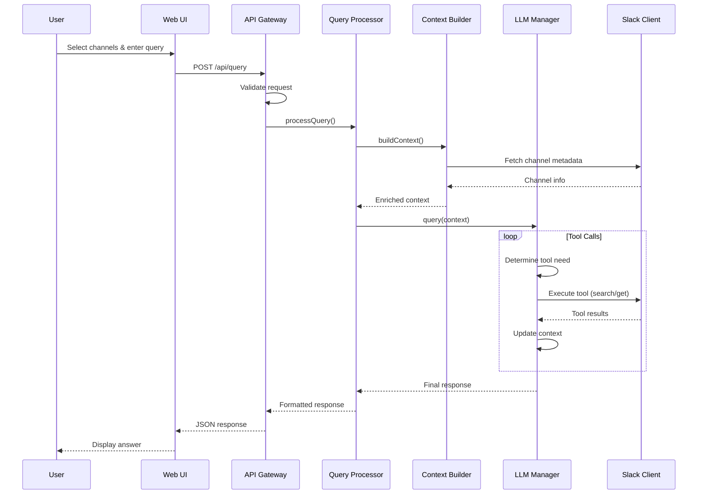
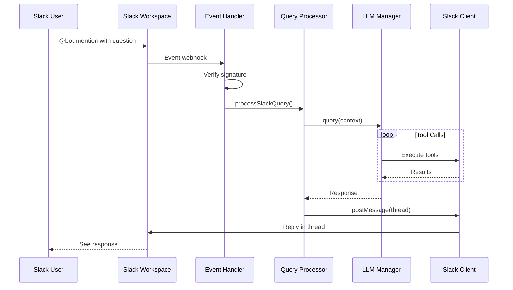

# Slack Knowledge Agent - System Design Document

## 1. Architecture Overview

### 1.1 High-Level Architecture

```
┌─────────────────────────────────────────────────────────────┐
│                         Users                               │
└─────────────┬────────────────────┬──────────────────────────┘
              │                    │
              ▼                    ▼
        ┌──────────┐        ┌──────────────┐
        │   Slack  │        │ Web Browser  │
        │Workspace │        │   (React)    │
        └────┬─────┘        └──────┬───────┘
             │                     │
             │ Events/Mentions     │ HTTP/WebSocket
             ▼                     ▼
┌────────────────────────────────────────────────────────────┐
│                     Backend Service                        │
│  ┌──────────────────────────────────────────────────────┐ │
│  │                  API Gateway Layer                    │ │
│  │  ├─ REST API Handler                                 │ │
│  │  ├─ Slack Event Handler                              │ │
│  │  └─ WebSocket Manager                                │ │
│  └───────────────┬──────────────────────────────────────┘ │
│                  │                                         │
│  ┌───────────────▼──────────────────────────────────────┐ │
│  │              Core Business Logic                      │ │
│  │  ├─ Query Processor                                  │ │
│  │  ├─ Context Builder                                  │ │
│  │  └─ Response Generator                               │ │
│  └───────────────┬──────────────────────────────────────┘ │
│                  │                                         │
│  ┌───────────────▼──────────────────────────────────────┐ │
│  │            Integration Layer                          │ │
│  │  ┌─────────────┐  ┌─────────────┐  ┌──────────────┐│ │
│  │  │Slack Client │  │ LLM Manager │  │Config Manager││ │
│  │  └─────────────┘  └─────────────┘  └──────────────┘│ │
│  └───────────────────────────────────────────────────────┘ │
└────────────────────────────────────────────────────────────┘
                           │
                           ▼
            ┌──────────────────────────────┐
            │   External Services          │
            │  ├─ Slack API               │
            │  ├─ OpenAI API              │
            │  └─ Anthropic API           │
            └──────────────────────────────┘
```

### 1.2 Component Responsibilities

| Component | Responsibility | Key Technologies |
|-----------|---------------|------------------|
| Web Frontend | User interface for channel selection and querying | React, Vite, Shadcn/ui, TanStack Query |
| API Gateway | Request routing, validation, rate limiting | Express/Fastify, Zod |
| Query Processor | Parse queries, orchestrate data retrieval | TypeScript, Business Logic |
| Slack Client | Interface with Slack APIs | @slack/web-api, @slack/events-api |
| LLM Manager | Abstract LLM providers, manage tool calls | LangChain, OpenAI SDK, Anthropic SDK |
| Config Manager | Load and validate configuration | JSON Schema, Chokidar |

## 2. Detailed Component Design

### 2.1 Backend Service Architecture

#### 2.1.1 Directory Structure
```
slack-knowledge-agent/
├── src/
│   ├── api/
│   │   ├── routes/
│   │   │   ├── query.routes.ts
│   │   │   ├── channels.routes.ts
│   │   │   ├── health.routes.ts
│   │   │   └── slack.routes.ts
│   │   ├── middleware/
│   │   │   ├── error.middleware.ts
│   │   │   ├── validation.middleware.ts
│   │   │   └── logging.middleware.ts
│   │   └── validators/
│   │       └── schemas.ts
│   ├── core/
│   │   ├── query/
│   │   │   ├── QueryProcessor.ts
│   │   │   ├── ContextBuilder.ts
│   │   │   └── ResponseGenerator.ts
│   │   └── config/
│   │       ├── ConfigManager.ts
│   │       └── ChannelConfig.ts
│   ├── integrations/
│   │   ├── slack/
│   │   │   ├── SlackClient.ts
│   │   │   ├── SlackEventHandler.ts
│   │   │   └── SlackTools.ts
│   │   └── llm/
│   │       ├── LLMManager.ts
│   │       ├── providers/
│   │       │   ├── OpenAIProvider.ts
│   │       │   └── AnthropicProvider.ts
│   │       └── tools/
│   │           └── ToolDefinitions.ts
│   ├── utils/
│   │   ├── logger.ts
│   │   ├── errors.ts
│   │   └── retry.ts
│   ├── types/
│   │   └── index.ts
│   └── server.ts
├── config/
│   └── channels.json
├── tests/
├── docker/
│   └── Dockerfile
└── package.json
```

#### 2.1.2 Module Interfaces

```typescript
// Core Interfaces

interface IQueryProcessor {
  processQuery(request: QueryRequest): Promise<QueryResponse>;
  validateChannelAccess(channelIds: string[]): Promise<boolean>;
}

interface IContextBuilder {
  buildContext(
    query: string, 
    channels: string[], 
    options: QueryOptions
  ): Promise<LLMContext>;
  enrichWithChannelMetadata(
    context: LLMContext, 
    config: ChannelConfig
  ): LLMContext;
}

interface ISlackClient {
  searchMessages(params: SearchParams): Promise<Message[]>;
  getThread(channelId: string, threadTs: string): Promise<Thread>;
  getChannelInfo(channelId: string): Promise<Channel>;
  listFiles(params: FileListParams): Promise<File[]>;
  getFileContent(fileId: string): Promise<FileContent>;
}

interface ILLMManager {
  query(
    context: LLMContext, 
    provider?: LLMProvider
  ): Promise<LLMResponse>;
  registerTools(tools: Tool[]): void;
  switchProvider(provider: LLMProvider): void;
}

interface IConfigManager {
  loadConfig(): Promise<ChannelConfig>;
  watchConfig(callback: ConfigChangeCallback): void;
  validateConfig(config: unknown): ChannelConfig;
}
```

### 2.2 Data Flow Design

#### 2.2.1 Web Query Flow



#### 2.2.2 Slack Mention Flow



### 2.3 LLM Tool Implementation

#### 2.3.1 Tool Definitions

```typescript
// Tool Definitions for LLM

const slackTools: Tool[] = [
  {
    name: "search_messages",
    description: "Search for messages in Slack channels",
    parameters: {
      type: "object",
      properties: {
        query: { 
          type: "string", 
          description: "Search query terms" 
        },
        channels: { 
          type: "array", 
          items: { type: "string" },
          description: "Channel IDs to search" 
        },
        limit: { 
          type: "number", 
          description: "Maximum results",
          default: 50 
        },
        time_range: {
          type: "object",
          properties: {
            start: { type: "string", format: "date-time" },
            end: { type: "string", format: "date-time" }
          }
        }
      },
      required: ["query", "channels"]
    },
    execute: async (params) => {
      return await slackClient.searchMessages(params);
    }
  },
  
  {
    name: "get_thread",
    description: "Retrieve a complete thread conversation",
    parameters: {
      type: "object",
      properties: {
        channel_id: { type: "string" },
        thread_ts: { type: "string" }
      },
      required: ["channel_id", "thread_ts"]
    },
    execute: async (params) => {
      return await slackClient.getThread(
        params.channel_id, 
        params.thread_ts
      );
    }
  },
  
  {
    name: "get_channel_info",
    description: "Get detailed channel information",
    parameters: {
      type: "object",
      properties: {
        channel_id: { type: "string" }
      },
      required: ["channel_id"]
    },
    execute: async (params) => {
      return await slackClient.getChannelInfo(params.channel_id);
    }
  },
  
  {
    name: "list_files",
    description: "List files shared in channels",
    parameters: {
      type: "object",
      properties: {
        channels: { 
          type: "array", 
          items: { type: "string" } 
        },
        types: { 
          type: "array", 
          items: { type: "string" } 
        },
        limit: { type: "number", default: 20 }
      },
      required: ["channels"]
    },
    execute: async (params) => {
      return await slackClient.listFiles(params);
    }
  },
  
  {
    name: "get_file_content",
    description: "Retrieve file content or preview",
    parameters: {
      type: "object",
      properties: {
        file_id: { type: "string" }
      },
      required: ["file_id"]
    },
    execute: async (params) => {
      return await slackClient.getFileContent(params.file_id);
    }
  }
];
```

#### 2.3.2 Tool Execution Flow

```typescript
class LLMManager {
  private tools: Map<string, Tool> = new Map();
  private provider: ILLMProvider;
  
  async query(context: LLMContext): Promise<LLMResponse> {
    let messages = this.buildInitialMessages(context);
    let toolCallsCount = 0;
    const maxToolCalls = 10;
    
    while (toolCallsCount < maxToolCalls) {
      const response = await this.provider.complete({
        messages,
        tools: Array.from(this.tools.values()),
        tool_choice: "auto"
      });
      
      if (!response.tool_calls || response.tool_calls.length === 0) {
        return this.formatResponse(response);
      }
      
      // Execute tool calls
      for (const toolCall of response.tool_calls) {
        const tool = this.tools.get(toolCall.function.name);
        if (!tool) continue;
        
        try {
          const result = await tool.execute(
            JSON.parse(toolCall.function.arguments)
          );
          
          messages.push({
            role: "tool",
            tool_call_id: toolCall.id,
            content: JSON.stringify(result)
          });
        } catch (error) {
          messages.push({
            role: "tool",
            tool_call_id: toolCall.id,
            content: `Error: ${error.message}`
          });
        }
      }
      
      toolCallsCount++;
    }
    
    throw new Error("Maximum tool calls exceeded");
  }
}
```

### 2.4 Frontend Architecture

#### 2.4.1 Component Structure

```
frontend/
├── src/
│   ├── components/
│   │   ├── layout/
│   │   │   ├── Header.tsx
│   │   │   └── Layout.tsx
│   │   ├── channels/
│   │   │   ├── ChannelSelector.tsx
│   │   │   ├── ChannelCard.tsx
│   │   │   └── ChannelList.tsx
│   │   ├── query/
│   │   │   ├── QueryInput.tsx
│   │   │   ├── QueryHistory.tsx
│   │   │   └── QueryForm.tsx
│   │   └── response/
│   │       ├── ResponseDisplay.tsx
│   │       ├── ResponseLoading.tsx
│   │       └── ResponseError.tsx
│   ├── hooks/
│   │   ├── useChannels.ts
│   │   ├── useQuery.ts
│   │   └── useWebSocket.ts
│   ├── services/
│   │   ├── api.ts
│   │   └── websocket.ts
│   ├── types/
│   │   └── index.ts
│   ├── utils/
│   │   └── format.ts
│   └── App.tsx
```

#### 2.4.2 State Management

```typescript
// Using TanStack Query for server state

// hooks/useChannels.ts
export const useChannels = () => {
  return useQuery({
    queryKey: ['channels'],
    queryFn: fetchChannels,
    staleTime: 5 * 60 * 1000, // 5 minutes
  });
};

// hooks/useQuery.ts
export const useSlackQuery = () => {
  const queryClient = useQueryClient();
  
  return useMutation({
    mutationFn: submitQuery,
    onSuccess: (data) => {
      queryClient.setQueryData(['queryHistory'], (old) => {
        return [...(old || []), data];
      });
    },
  });
};

// Component usage
const QueryInterface = () => {
  const [selectedChannels, setSelectedChannels] = useState<string[]>([]);
  const { data: channels } = useChannels();
  const { mutate: submitQuery, isPending } = useSlackQuery();
  
  const handleSubmit = (question: string) => {
    submitQuery({
      question,
      channels: selectedChannels,
      options: {
        maxResults: 100,
        llmProvider: 'openai'
      }
    });
  };
  
  return (
    <div className="space-y-4">
      <ChannelSelector 
        channels={channels}
        selected={selectedChannels}
        onChange={setSelectedChannels}
      />
      <QueryForm 
        onSubmit={handleSubmit}
        isLoading={isPending}
      />
    </div>
  );
};
```

### 2.5 Error Handling & Resilience

#### 2.5.1 Error Hierarchy

```typescript
// Base error classes
abstract class BaseError extends Error {
  constructor(
    message: string,
    public code: string,
    public statusCode: number,
    public details?: any
  ) {
    super(message);
    this.name = this.constructor.name;
  }
}

class SlackError extends BaseError {
  constructor(message: string, code: string, details?: any) {
    super(message, code, 503, details);
  }
}

class LLMError extends BaseError {
  constructor(message: string, code: string, details?: any) {
    super(message, code, 503, details);
  }
}

class ValidationError extends BaseError {
  constructor(message: string, details?: any) {
    super(message, 'VALIDATION_ERROR', 400, details);
  }
}

class ConfigurationError extends BaseError {
  constructor(message: string, details?: any) {
    super(message, 'CONFIG_ERROR', 500, details);
  }
}
```

#### 2.5.2 Retry Strategy

```typescript
class RetryManager {
  async executeWithRetry<T>(
    fn: () => Promise<T>,
    options: RetryOptions = {}
  ): Promise<T> {
    const {
      maxAttempts = 3,
      backoffMs = 1000,
      backoffMultiplier = 2,
      shouldRetry = this.defaultShouldRetry
    } = options;
    
    let lastError: Error;
    
    for (let attempt = 1; attempt <= maxAttempts; attempt++) {
      try {
        return await fn();
      } catch (error) {
        lastError = error;
        
        if (attempt === maxAttempts || !shouldRetry(error)) {
          throw error;
        }
        
        const delay = backoffMs * Math.pow(backoffMultiplier, attempt - 1);
        await this.sleep(delay);
      }
    }
    
    throw lastError!;
  }
  
  private defaultShouldRetry(error: any): boolean {
    // Retry on network errors and 5xx status codes
    if (error.code === 'ECONNREFUSED' || error.code === 'ETIMEDOUT') {
      return true;
    }
    
    if (error.statusCode && error.statusCode >= 500) {
      return true;
    }
    
    // Don't retry on client errors
    return false;
  }
}
```

#### 2.5.3 Circuit Breaker Pattern

```typescript
class CircuitBreaker {
  private failureCount = 0;
  private lastFailureTime?: Date;
  private state: 'CLOSED' | 'OPEN' | 'HALF_OPEN' = 'CLOSED';
  
  constructor(
    private threshold: number = 5,
    private timeout: number = 60000 // 1 minute
  ) {}
  
  async execute<T>(fn: () => Promise<T>): Promise<T> {
    if (this.state === 'OPEN') {
      if (this.shouldAttemptReset()) {
        this.state = 'HALF_OPEN';
      } else {
        throw new Error('Circuit breaker is OPEN');
      }
    }
    
    try {
      const result = await fn();
      this.onSuccess();
      return result;
    } catch (error) {
      this.onFailure();
      throw error;
    }
  }
  
  private onSuccess(): void {
    this.failureCount = 0;
    this.state = 'CLOSED';
  }
  
  private onFailure(): void {
    this.failureCount++;
    this.lastFailureTime = new Date();
    
    if (this.failureCount >= this.threshold) {
      this.state = 'OPEN';
    }
  }
  
  private shouldAttemptReset(): boolean {
    return (
      this.lastFailureTime &&
      Date.now() - this.lastFailureTime.getTime() >= this.timeout
    );
  }
}
```

### 2.6 Security Design

#### 2.6.1 Request Validation

```typescript
// Zod schemas for validation
const QueryRequestSchema = z.object({
  question: z.string().min(1).max(1000),
  channels: z.array(z.string().regex(/^C[A-Z0-9]+$/)).min(1).max(20),
  options: z.object({
    maxResults: z.number().min(1).max(200).optional(),
    llmProvider: z.enum(['openai', 'anthropic']).optional()
  }).optional()
});

// Middleware
export const validateRequest = (schema: z.ZodSchema) => {
  return (req: Request, res: Response, next: NextFunction) => {
    try {
      req.body = schema.parse(req.body);
      next();
    } catch (error) {
      if (error instanceof z.ZodError) {
        res.status(400).json({
          error: 'Validation failed',
          details: error.errors
        });
      } else {
        next(error);
      }
    }
  };
};
```

#### 2.6.2 Slack Request Verification

```typescript
class SlackSecurityManager {
  constructor(private signingSecret: string) {}
  
  verifyRequest(req: Request): boolean {
    const timestamp = req.headers['x-slack-request-timestamp'] as string;
    const signature = req.headers['x-slack-signature'] as string;
    const body = req.rawBody;
    
    // Check timestamp to prevent replay attacks
    const requestTime = parseInt(timestamp);
    const currentTime = Math.floor(Date.now() / 1000);
    
    if (Math.abs(currentTime - requestTime) > 60 * 5) {
      return false; // Request is older than 5 minutes
    }
    
    // Verify signature
    const sigBasestring = `v0:${timestamp}:${body}`;
    const mySignature = 'v0=' + crypto
      .createHmac('sha256', this.signingSecret)
      .update(sigBasestring, 'utf8')
      .digest('hex');
    
    return crypto.timingSafeEqual(
      Buffer.from(mySignature, 'utf8'),
      Buffer.from(signature, 'utf8')
    );
  }
}
```

### 2.7 Performance Optimization

#### 2.7.1 Caching Strategy

```typescript
class CacheManager {
  private cache = new Map<string, CacheEntry>();
  
  set(key: string, value: any, ttlMs: number = 300000): void {
    this.cache.set(key, {
      value,
      expiry: Date.now() + ttlMs
    });
  }
  
  get(key: string): any | null {
    const entry = this.cache.get(key);
    
    if (!entry) return null;
    
    if (Date.now() > entry.expiry) {
      this.cache.delete(key);
      return null;
    }
    
    return entry.value;
  }
  
  // Channel info cache key generation
  getChannelCacheKey(channelId: string): string {
    return `channel:${channelId}`;
  }
  
  // Clean expired entries periodically
  startCleanup(intervalMs: number = 60000): void {
    setInterval(() => {
      const now = Date.now();
      for (const [key, entry] of this.cache.entries()) {
        if (now > entry.expiry) {
          this.cache.delete(key);
        }
      }
    }, intervalMs);
  }
}
```

#### 2.7.2 Request Batching

```typescript
class BatchProcessor {
  private queue: BatchItem[] = [];
  private timer?: NodeJS.Timeout;
  
  constructor(
    private processBatch: (items: BatchItem[]) => Promise<void>,
    private maxBatchSize: number = 10,
    private maxWaitMs: number = 100
  ) {}
  
  add(item: BatchItem): Promise<void> {
    return new Promise((resolve, reject) => {
      this.queue.push({ ...item, resolve, reject });
      
      if (this.queue.length >= this.maxBatchSize) {
        this.flush();
      } else if (!this.timer) {
        this.timer = setTimeout(() => this.flush(), this.maxWaitMs);
      }
    });
  }
  
  private async flush(): Promise<void> {
    if (this.timer) {
      clearTimeout(this.timer);
      this.timer = undefined;
    }
    
    if (this.queue.length === 0) return;
    
    const batch = this.queue.splice(0, this.maxBatchSize);
    
    try {
      await this.processBatch(batch);
      batch.forEach(item => item.resolve());
    } catch (error) {
      batch.forEach(item => item.reject(error));
    }
  }
}
```

### 2.8 Monitoring & Observability

#### 2.8.1 Metrics Collection

```typescript
interface Metrics {
  queryCount: number;
  queryDuration: Histogram;
  slackApiCalls: Counter;
  llmTokensUsed: Counter;
  errorRate: Gauge;
}

class MetricsCollector {
  private metrics: Metrics = {
    queryCount: 0,
    queryDuration: new Histogram(),
    slackApiCalls: new Counter(),
    llmTokensUsed: new Counter(),
    errorRate: new Gauge()
  };
  
  recordQuery(duration: number, tokensUsed: number): void {
    this.metrics.queryCount++;
    this.metrics.queryDuration.observe(duration);
    this.metrics.llmTokensUsed.add(tokensUsed);
  }
  
  recordSlackApiCall(endpoint: string): void {
    this.metrics.slackApiCalls.inc({ endpoint });
  }
  
  recordError(type: string): void {
    this.metrics.errorRate.inc({ type });
  }
  
  getMetrics(): any {
    return {
      queries: {
        total: this.metrics.queryCount,
        avgDuration: this.metrics.queryDuration.mean(),
        p95Duration: this.metrics.queryDuration.percentile(95)
      },
      slack: {
        apiCalls: this.metrics.slackApiCalls.value()
      },
      llm: {
        tokensUsed: this.metrics.llmTokensUsed.value()
      },
      errors: {
        rate: this.metrics.errorRate.value()
      }
    };
  }
}
```

#### 2.8.2 Structured Logging

```typescript
class Logger {
  private context: Record<string, any> = {};
  
  constructor(private name: string) {}
  
  child(context: Record<string, any>): Logger {
    const child = new Logger(this.name);
    child.context = { ...this.context, ...context };
    return child;
  }
  
  private log(level: string, message: string, meta?: any): void {
    const entry = {
      timestamp: new Date().toISOString(),
      level,
      logger: this.name,
      message,
      ...this.context,
      ...meta
    };
    
    console.log(JSON.stringify(entry));
  }
  
  info(message: string, meta?: any): void {
    this.log('INFO', message, meta);
  }
  
  error(message: string, error?: Error, meta?: any): void {
    this.log('ERROR', message, {
      ...meta,
      error: error ? {
        name: error.name,
        message: error.message,
        stack: error.stack
      } : undefined
    });
  }
  
  debug(message: string, meta?: any): void {
    if (process.env.NODE_ENV !== 'production') {
      this.log('DEBUG', message, meta);
    }
  }
}
```

### 2.9 Testing Strategy

#### 2.9.1 Test Structure

```
tests/
├── unit/
│   ├── core/
│   │   ├── QueryProcessor.test.ts
│   │   ├── ContextBuilder.test.ts
│   │   └── ResponseGenerator.test.ts
│   ├── integrations/
│   │   ├── SlackClient.test.ts
│   │   └── LLMManager.test.ts
│   └── utils/
│       └── retry.test.ts
├── integration/
│   ├── api/
│   │   ├── query.test.ts
│   │   └── channels.test.ts
│   └── slack/
│       └── events.test.ts
├── e2e/
│   └── full-flow.test.ts
└── fixtures/
    ├── slack-responses.json
    └── llm-responses.json
```

#### 2.9.2 Mock Implementations

```typescript
// Mock Slack Client for testing
class MockSlackClient implements ISlackClient {
  private messages: Map<string, Message[]> = new Map();
  
  async searchMessages(params: SearchParams): Promise<Message[]> {
    const allMessages = Array.from(this.messages.values()).flat();
    return allMessages
      .filter(m => m.text.includes(params.query))
      .slice(0, params.limit);
  }
  
  async getThread(channelId: string, threadTs: string): Promise<Thread> {
    return {
      messages: this.messages.get(`${channelId}:${threadTs}`) || [],
      channel: channelId,
      thread_ts: threadTs
    };
  }
  
  setMockData(channel: string, messages: Message[]): void {
    this.messages.set(channel, messages);
  }
}

// Mock LLM Provider
class MockLLMProvider implements ILLMProvider {
  private responses: string[] = [];
  private currentIndex = 0;
  
  async complete(request: CompletionRequest): Promise<CompletionResponse> {
    const response = this.responses[this.currentIndex++ % this.responses.length];
    return {
      content: response,
      tool_calls: [],
      usage: { prompt_tokens: 100, completion_tokens: 50 }
    };
  }
  
  setResponses(responses: string[]): void {
    this.responses = responses;
  }
}
```

## 3. Deployment Design

### 3.1 Docker Configuration

```dockerfile
# Multi-stage Dockerfile
FROM node:20-alpine AS builder

WORKDIR /app

# Copy package files
COPY package*.json ./
COPY pnpm-lock.yaml ./

# Install dependencies
RUN npm install -g pnpm
RUN pnpm install --frozen-lockfile

# Copy source code
COPY . .

# Build application
RUN pnpm run build

# Production stage
FROM node:20-alpine

WORKDIR /app

# Install production dependencies only
COPY package*.json ./
COPY pnpm-lock.yaml ./
RUN npm install -g pnpm
RUN pnpm install --prod --frozen-lockfile

# Copy built application
COPY --from=builder /app/dist ./dist
COPY --from=builder /app/config ./config

# Create non-root user
RUN addgroup -g 1001 -S nodejs
RUN adduser -S nodejs -u 1001
USER nodejs

# Health check
HEALTHCHECK --interval=30s --timeout=3s --start-period=5s --retries=3 \
  CMD node -e "require('http').get('http://localhost:3000/api/health', (r) => {process.exit(r.statusCode === 200 ? 0 : 1)})"

EXPOSE 3000

CMD ["node", "dist/server.js"]
```

### 3.2 Docker Compose for Development

```yaml
version: '3.8'

services:
  backend:
    build:
      context: .
      dockerfile: docker/Dockerfile
    ports:
      - "3000:3000"
    environment:
      - NODE_ENV=development
      - SLACK_BOT_TOKEN=${SLACK_BOT_TOKEN}
      - SLACK_SIGNING_SECRET=${SLACK_SIGNING_SECRET}
      - SLACK_APP_TOKEN=${SLACK_APP_TOKEN}
      - OPENAI_API_KEY=${OPENAI_API_KEY}
      - ANTHROPIC_API_KEY=${ANTHROPIC_API_KEY}
    volumes:
      - ./config:/app/config:ro
      - ./src:/app/src:ro
    networks:
      - slack-agent-network

  frontend:
    build:
      context: ./frontend
      dockerfile: Dockerfile.dev
    ports:
      - "5173:5173"
    environment:
      - VITE_API_URL=http://localhost:3000
    volumes:
      - ./frontend/src:/app/src:ro
    networks:
      - slack-agent-network

networks:
  slack-agent-network:
    driver: bridge
```

## 4. Configuration Management

### 4.1 Environment Configuration

```typescript
// config/env.ts
import { z } from 'zod';

const EnvSchema = z.object({
  // Server
  NODE_ENV: z.enum(['development', 'production', 'test']),
  PORT: z.string().transform(Number).default('3000'),
  
  // Slack
  SLACK_BOT_TOKEN: z.string().startsWith('xoxb-'),
  SLACK_SIGNING_SECRET: z.string(),
  SLACK_APP_TOKEN: z.string().startsWith('xapp-'),
  
  // LLM
  OPENAI_API_KEY: z.string().startsWith('sk-'),
  ANTHROPIC_API_KEY: z.string().startsWith('sk-ant-'),
  DEFAULT_LLM_PROVIDER: z.enum(['openai', 'anthropic']).default('openai'),
  LLM_MODEL: z.string().default('gpt-4-turbo-preview'),
  MAX_CONTEXT_TOKENS: z.string().transform(Number).default('8000'),
  
  // Query limits
  MAX_HISTORY_DAYS: z.string().transform(Number).default('90'),
  DEFAULT_QUERY_LIMIT: z.string().transform(Number).default('50'),
  MAX_QUERY_LIMIT: z.string().transform(Number).default('200'),
});

export const config = EnvSchema.parse(process.env);
```

### 4.2 Channel Configuration

```typescript
// config/channels.ts
import { z } from 'zod';
import { promises as fs } from 'fs';
import { watch } from 'chokidar';

const ChannelSchema = z.object({
  id: z.string().regex(/^C[A-Z0-9]+$/),
  name: z.string(),
  description: z.string()
});

const ChannelConfigSchema = z.object({
  channels: z.array(ChannelSchema)
});

export class ChannelConfigManager {
  private config?: z.infer<typeof ChannelConfigSchema>;
  private watchers: Array<(config: any) => void> = [];
  
  async load(path: string = './config/channels.json'): Promise<void> {
    const content = await fs.readFile(path, 'utf-8');
    this.config = ChannelConfigSchema.parse(JSON.parse(content));
    this.notifyWatchers();
  }
  
  watch(path: string = './config/channels.json'): void {
    const watcher = watch(path);
    
    watcher.on('change', async () => {
      await this.load(path);
    });
  }
  
  onChange(callback: (config: any) => void): void {
    this.watchers.push(callback);
  }
  
  private notifyWatchers(): void {
    this.watchers.forEach(cb => cb(this.config));
  }
  
  getChannel(id: string): any {
    return this.config?.channels.find(c => c.id === id);
  }
  
  getAllChannels(): any[] {
    return this.config?.channels || [];
  }
}
```

## 5. API Contracts

### 5.1 OpenAPI Specification

```yaml
openapi: 3.0.0
info:
  title: Slack Knowledge Agent API
  version: 1.0.0
  description: API for querying Slack workspace knowledge

paths:
  /api/query:
    post:
      summary: Submit a query
      requestBody:
        required: true
        content:
          application/json:
            schema:
              type: object
              required:
                - question
                - channels
              properties:
                question:
                  type: string
                  minLength: 1
                  maxLength: 1000
                channels:
                  type: array
                  items:
                    type: string
                    pattern: '^C[A-Z0-9]+$'
                  minItems: 1
                  maxItems: 20
                options:
                  type: object
                  properties:
                    maxResults:
                      type: integer
                      minimum: 1
                      maximum: 200
                    llmProvider:
                      type: string
                      enum: [openai, anthropic]
      responses:
        200:
          description: Successful query
          content:
            application/json:
              schema:
                type: object
                properties:
                  answer:
                    type: string
                  metadata:
                    type: object
                    properties:
                      tokensUsed:
                        type: integer
                      queryTime:
                        type: number
                      messagesAnalyzed:
                        type: integer
        400:
          description: Invalid request
        503:
          description: Service unavailable

  /api/channels:
    get:
      summary: Get available channels
      responses:
        200:
          description: List of channels
          content:
            application/json:
              schema:
                type: object
                properties:
                  channels:
                    type: array
                    items:
                      type: object
                      properties:
                        id:
                          type: string
                        name:
                          type: string
                        description:
                          type: string
                        memberCount:
                          type: integer

  /api/health:
    get:
      summary: Health check
      responses:
        200:
          description: Service is healthy
          content:
            application/json:
              schema:
                type: object
                properties:
                  status:
                    type: string
                    enum: [healthy, unhealthy]
                  services:
                    type: object
                    properties:
                      slack:
                        type: string
                      llm:
                        type: string
                  timestamp:
                    type: string
                    format: date-time

  /slack/events:
    post:
      summary: Slack Events webhook
      requestBody:
        required: true
        content:
          application/json:
            schema:
              type: object
      responses:
        200:
          description: Event processed
        403:
          description: Invalid signature
```

## 6. Development Workflow

### 6.1 Git Workflow

```bash
# Branch naming convention
feature/SKA-{ticket}-{description}
bugfix/SKA-{ticket}-{description}
hotfix/SKA-{ticket}-{description}

# Commit message format
feat: Add channel selection component
fix: Resolve Slack API timeout issue
docs: Update API documentation
test: Add unit tests for QueryProcessor
refactor: Optimize LLM context building
```

### 6.2 Development Scripts

```json
{
  "scripts": {
    "dev": "nodemon src/server.ts",
    "build": "tsc",
    "start": "node dist/server.js",
    "test": "jest",
    "test:watch": "jest --watch",
    "test:coverage": "jest --coverage",
    "lint": "eslint src/**/*.ts",
    "format": "prettier --write src/**/*.ts",
    "docker:build": "docker build -t slack-knowledge-agent .",
    "docker:run": "docker run -p 3000:3000 --env-file .env slack-knowledge-agent"
  }
}
```

## 7. Performance Benchmarks

### 7.1 Target Metrics

| Metric | Target | Maximum |
|--------|--------|---------|
| Query Response Time | < 10s | 30s |
| Slack API Call Time | < 2s | 5s |
| LLM Response Time | < 8s | 20s |
| Concurrent Queries | 10 | 50 |
| Memory Usage | < 256MB | 512MB |
| CPU Usage | < 50% | 80% |

### 7.2 Load Testing

```typescript
// Load test configuration
const loadTestConfig = {
  scenarios: {
    steadyLoad: {
      executor: 'constant-vus',
      vus: 10,
      duration: '5m',
    },
    rampUp: {
      executor: 'ramping-vus',
      startVUs: 0,
      stages: [
        { duration: '2m', target: 20 },
        { duration: '3m', target: 20 },
        { duration: '2m', target: 0 },
      ],
    },
  },
  thresholds: {
    http_req_duration: ['p(95)<10000'], // 95% of requests under 10s
    http_req_failed: ['rate<0.1'], // Error rate under 10%
  },
};
```

## 8. Future Considerations

### 8.1 Scalability Path
- Implement Redis for distributed caching
- Add message queue (RabbitMQ/Kafka) for async processing
- Horizontal scaling with load balancer
- Database for conversation history

### 8.2 Feature Extensions
- WebSocket for real-time updates
- Batch query processing
- Query result caching
- User session management
- Analytics dashboard
- Custom tool function framework

### 8.3 Integration Points
- Slack workflow builder integration
- Microsoft Teams adapter
- Discord adapter
- Custom webhook integrations
- Export functionality (PDF, CSV)

## 9. Conclusion

This design document provides a comprehensive blueprint for implementing the Slack Knowledge Agent. The architecture emphasizes:

- **Modularity**: Clean separation of concerns with well-defined interfaces
- **Scalability**: Stateless design enabling horizontal scaling
- **Resilience**: Error handling, retries, and circuit breakers
- **Performance**: Optimization strategies for efficient operation
- **Maintainability**: Clear structure and comprehensive testing

The design supports the core requirements while providing flexibility for future enhancements and scale.