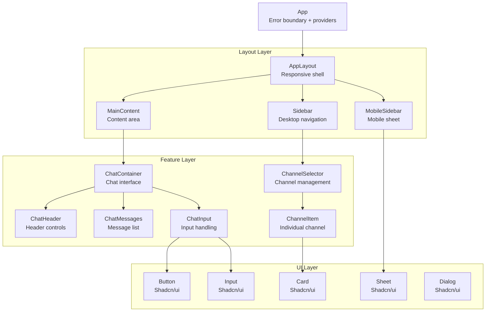

# Component Architecture

This document outlines the component architecture patterns used in the Slack Knowledge Agent frontend application.

## Overview

The application follows a modern React component architecture with clear separation of concerns, TypeScript interfaces, and integration with Zustand stores for state management.

## Component Hierarchy



## Component Types

### 1. Layout Components

Layout components handle the overall application structure and responsive behavior.

#### AppLayout
```typescript
// src/components/layout/AppLayout.tsx
export function AppLayout() {
  const isMobileSidebarOpen = useUIStore((state) => state.isMobileSidebarOpen);
  const { isMobile, isDesktop } = useResponsiveLayout();

  return (
    <div className="h-screen bg-background">
      <div className="h-full flex">
        {isMobile && <MobileSidebar isOpen={isMobileSidebarOpen} />}
        {isDesktop && <Sidebar />}
        <MainContent />
      </div>
    </div>
  );
}
```

**Responsibilities:**
- Responsive layout switching between mobile/desktop
- Integration with UI store for sidebar state
- Overall application shell structure

### 2. Feature Components

Feature components implement specific business logic and user interactions.

#### ChatContainer
```typescript
// src/components/chat/ChatContainer.tsx
interface ChatContainerProps {
  className?: string;
}

export function ChatContainer({ className }: ChatContainerProps) {
  const selectedChannels = useSelectedChannels();
  const hasSelectedChannels = useHasSelectedChannels();
  const { 
    messages, 
    sendMessage, 
    isAiTyping, 
    startNewConversation 
  } = useChatManager();

  if (!hasSelectedChannels) {
    return <EmptyStateMessage />;
  }

  return (
    <div className={cn("flex flex-col h-full", className)}>
      <ChatHeader onNewConversation={startNewConversation} />
      <ChatMessages messages={messages} isAiTyping={isAiTyping} />
      <ChatInput onSendMessage={sendMessage} channels={selectedChannels} />
    </div>
  );
}
```

**Responsibilities:**
- Chat business logic coordination
- Integration with Zustand stores and custom hooks
- Conditional rendering based on application state

### 3. UI Components (Shadcn/ui)

Base UI components provide consistent design system implementation.

```typescript
// Example: Button component usage
import { Button } from '@/components/ui/button';

<Button 
  variant="default" 
  size="sm" 
  onClick={handleClick}
  disabled={isLoading}
>
  {isLoading ? <Spinner /> : 'Send Message'}
</Button>
```

## Component Patterns

### 1. Container/Presentation Pattern

Separate data fetching and business logic from presentation.

```typescript
// Container component - handles data and business logic
function ChannelSelectorContainer() {
  const { data: channels, isLoading, error } = useChannelsQuery();
  const selectedChannels = useSelectedChannels();
  const selectChannel = useChannelStore((state) => state.selectChannel);

  if (isLoading) return <ChannelSelectorSkeleton />;
  if (error) return <ChannelSelectorError error={error} />;

  return (
    <ChannelSelectorPresentation
      channels={channels}
      selectedChannels={selectedChannels}
      onChannelSelect={selectChannel}
    />
  );
}

// Presentation component - pure UI
interface ChannelSelectorPresentationProps {
  channels: Channel[];
  selectedChannels: string[];
  onChannelSelect: (channelId: string) => void;
}

function ChannelSelectorPresentation({
  channels,
  selectedChannels,
  onChannelSelect
}: ChannelSelectorPresentationProps) {
  return (
    <div className="space-y-2">
      {channels.map((channel) => (
        <ChannelItem
          key={channel.id}
          channel={channel}
          isSelected={selectedChannels.includes(channel.id)}
          onSelect={() => onChannelSelect(channel.id)}
        />
      ))}
    </div>
  );
}
```

### 2. Compound Components

Build complex components from simpler, composable parts.

```typescript
// Chat compound component structure
export function Chat() {
  return (
    <ChatProvider>
      <Chat.Header />
      <Chat.Messages />
      <Chat.Input />
    </ChatProvider>
  );
}

Chat.Header = ChatHeader;
Chat.Messages = ChatMessages;  
Chat.Input = ChatInput;
```

### 3. Render Props Pattern

Share logic between components using render props.

```typescript
interface ErrorBoundaryProps {
  children: React.ReactNode;
  fallback?: (error: Error) => React.ReactNode;
  onError?: (error: Error, errorInfo: ErrorInfo) => void;
}

export function ErrorBoundary({ 
  children, 
  fallback, 
  onError 
}: ErrorBoundaryProps) {
  return (
    <ReactErrorBoundary
      fallback={fallback || <DefaultErrorFallback />}
      onError={(error, errorInfo) => {
        onError?.(error, errorInfo);
        // Log to error store
        useErrorStore.getState().setError('global', error.message);
      }}
    >
      {children}
    </ReactErrorBoundary>
  );
}
```

## Component Structure Standards

### TypeScript Interface Pattern

```typescript
// Always define props interface with JSDoc
interface ComponentProps {
  /** Primary title displayed in the header */
  title: string;
  /** Optional description text */
  description?: string;
  /** Callback fired when action is performed */
  onAction?: (data: ActionData) => void;
  /** Loading state indicator */
  isLoading?: boolean;
  /** Additional CSS classes */
  className?: string;
}

export function MyComponent({ 
  title, 
  description, 
  onAction, 
  isLoading = false,
  className 
}: ComponentProps) {
  // Implementation
}
```

### Component File Structure

```typescript
// src/components/feature/MyComponent.tsx

import { useState, useCallback } from 'react';
import { cn } from '@/lib/utils';
import { useMyStore } from '@/stores';
import { Button } from '@/components/ui/button';

// 1. Types and interfaces
interface MyComponentProps {
  // Props definition
}

// 2. Main component
export function MyComponent({ prop1, prop2 }: MyComponentProps) {
  // 3. Hooks (stores, queries, local state)
  const storeValue = useMyStore((state) => state.value);
  const [localState, setLocalState] = useState('');

  // 4. Event handlers and callbacks
  const handleClick = useCallback(() => {
    // Handle click
  }, []);

  // 5. Early returns for error/loading states
  if (error) return <ErrorState />;
  if (loading) return <LoadingState />;

  // 6. Main render
  return (
    <div className={cn("base-classes", className)}>
      {/* JSX content */}
    </div>
  );
}

// 7. Default props (if needed)
MyComponent.defaultProps = {
  isLoading: false,
};
```

## State Integration Patterns

### Zustand Store Integration

```typescript
function MyComponent() {
  // ✅ Selective subscriptions - re-renders only when specific values change
  const selectedChannels = useChannelStore((state) => state.selectedChannelIds);
  const selectChannel = useChannelStore((state) => state.selectChannel);
  
  // ✅ Multiple related values with shallow comparison
  const { isOpen, toggle, close } = useUIStore(
    (state) => ({
      isOpen: state.isMobileSidebarOpen,
      toggle: state.toggleMobileSidebar,
      close: state.closeMobileSidebar,
    }),
    shallow
  );

  // ✅ Computed selectors
  const channelCount = useChannelStore(
    (state) => state.selectedChannelIds.length
  );

  return (
    <div>
      <p>Selected {channelCount} channels</p>
      <button onClick={toggle}>
        {isOpen ? 'Close' : 'Open'} Sidebar
      </button>
    </div>
  );
}
```

### TanStack Query Integration

```typescript
function ChannelList() {
  const { 
    data: channels, 
    isLoading, 
    error,
    refetch 
  } = useChannelsQuery();

  // Loading state
  if (isLoading) {
    return (
      <div className="space-y-2">
        {Array.from({ length: 5 }).map((_, i) => (
          <ChannelItemSkeleton key={i} />
        ))}
      </div>
    );
  }

  // Error state with retry
  if (error) {
    return (
      <div className="text-center py-8">
        <p className="text-destructive mb-4">Failed to load channels</p>
        <Button onClick={() => refetch()} variant="outline">
          Try Again
        </Button>
      </div>
    );
  }

  // Success state
  return (
    <div className="space-y-2">
      {channels?.map((channel) => (
        <ChannelItem key={channel.id} channel={channel} />
      ))}
    </div>
  );
}
```

## Responsive Design Patterns

### Breakpoint-Based Components

```typescript
function ResponsiveLayout() {
  const { isMobile, isTablet, isDesktop } = useResponsiveLayout();

  return (
    <div className="flex">
      {/* Mobile: Sheet sidebar */}
      {isMobile && (
        <Sheet>
          <MobileSidebar />
        </Sheet>
      )}

      {/* Tablet/Desktop: Fixed sidebar */}
      {(isTablet || isDesktop) && (
        <aside className="w-80 border-r">
          <DesktopSidebar />
        </aside>
      )}

      <main className="flex-1">
        <MainContent />
      </main>
    </div>
  );
}
```

### CSS-Based Responsive Components

```typescript
function AdaptiveComponent() {
  return (
    <div className="flex flex-col lg:flex-row gap-4">
      {/* Mobile: Full width, stacked */}
      {/* Desktop: Side-by-side */}
      <div className="lg:w-1/3">
        <Sidebar />
      </div>
      <div className="lg:w-2/3">
        <MainContent />
      </div>
    </div>
  );
}
```

## Error Handling Patterns

### Component-Level Error Boundaries

```typescript
function FeatureComponent() {
  return (
    <ErrorBoundary
      fallback={(error) => (
        <div className="p-4 border border-destructive/20 rounded">
          <h3>Feature temporarily unavailable</h3>
          <p className="text-sm text-muted-foreground">{error.message}</p>
        </div>
      )}
      onError={(error) => {
        console.error('Feature error:', error);
        // Log to monitoring service
      }}
    >
      <ActualFeatureComponent />
    </ErrorBoundary>
  );
}
```

### Query Error Handling

```typescript
function DataComponent() {
  const { data, error, isLoading } = useMyQuery();
  const setError = useErrorStore((state) => state.setError);

  useEffect(() => {
    if (error) {
      setError('api', error.message);
    }
  }, [error, setError]);

  if (isLoading) return <LoadingSkeleton />;
  if (error) return <ErrorDisplay error={error} />;
  
  return <DataDisplay data={data} />;
}
```

## Performance Optimization

### React.memo Usage

```typescript
// Memoize components that receive stable props
const ChannelItem = memo(({ 
  channel, 
  isSelected, 
  onSelect 
}: ChannelItemProps) => {
  return (
    <Card 
      className={cn(
        "cursor-pointer transition-colors",
        isSelected && "bg-accent"
      )}
      onClick={onSelect}
    >
      <CardContent className="p-3">
        <div className="flex items-center gap-2">
          <span className="text-sm font-medium">{channel.name}</span>
          {isSelected && <Check className="h-4 w-4" />}
        </div>
      </CardContent>
    </Card>
  );
});
```

### Callback Memoization

```typescript
function ParentComponent() {
  const [filter, setFilter] = useState('');
  
  // Memoize callbacks to prevent unnecessary re-renders
  const handleChannelSelect = useCallback((channelId: string) => {
    useChannelStore.getState().selectChannel(channelId);
  }, []);

  const handleFilterChange = useCallback((value: string) => {
    setFilter(value);
  }, []);

  return (
    <div>
      <SearchInput onValueChange={handleFilterChange} />
      <ChannelList 
        filter={filter}
        onChannelSelect={handleChannelSelect} 
      />
    </div>
  );
}
```

## Testing Patterns

### Component Testing

```typescript
// __tests__/ChatContainer.test.tsx
import { render, screen, fireEvent } from '@testing-library/react';
import { QueryClient, QueryClientProvider } from '@tanstack/react-query';
import { ChatContainer } from '../ChatContainer';

// Test wrapper with providers
function TestWrapper({ children }: { children: React.ReactNode }) {
  const queryClient = new QueryClient({
    defaultOptions: { queries: { retry: false } },
  });

  return (
    <QueryClientProvider client={queryClient}>
      {children}
    </QueryClientProvider>
  );
}

describe('ChatContainer', () => {
  beforeEach(() => {
    // Reset stores
    useChannelStore.getState().clearSelectedChannels();
    useErrorStore.getState().clearAllErrors();
  });

  it('shows empty state when no channels selected', () => {
    render(
      <TestWrapper>
        <ChatContainer />
      </TestWrapper>
    );

    expect(screen.getByText(/select at least one channel/i)).toBeInTheDocument();
  });

  it('shows chat interface when channels selected', () => {
    // Setup test state
    useChannelStore.getState().selectChannel('channel-1');

    render(
      <TestWrapper>
        <ChatContainer />
      </TestWrapper>
    );

    expect(screen.getByRole('textbox')).toBeInTheDocument();
    expect(screen.getByRole('button', { name: /send/i })).toBeInTheDocument();
  });
});
```

## Accessibility Patterns

### Semantic HTML and ARIA

```typescript
function ChannelSelector() {
  const [selectedChannels, setSelectedChannels] = useState<string[]>([]);

  return (
    <div role="group" aria-labelledby="channel-selector-heading">
      <h2 id="channel-selector-heading" className="sr-only">
        Select Channels
      </h2>
      
      <div className="space-y-2">
        {channels.map((channel) => (
          <label
            key={channel.id}
            className="flex items-center gap-2 p-2 rounded cursor-pointer hover:bg-accent"
          >
            <input
              type="checkbox"
              checked={selectedChannels.includes(channel.id)}
              onChange={(e) => {
                if (e.target.checked) {
                  setSelectedChannels(prev => [...prev, channel.id]);
                } else {
                  setSelectedChannels(prev => prev.filter(id => id !== channel.id));
                }
              }}
              aria-describedby={`channel-${channel.id}-desc`}
              className="sr-only"
            />
            <div className="flex-1">
              <div className="font-medium">{channel.name}</div>
              <div 
                id={`channel-${channel.id}-desc`}
                className="text-sm text-muted-foreground"
              >
                {channel.description || 'No description'}
              </div>
            </div>
            {selectedChannels.includes(channel.id) && (
              <Check className="h-4 w-4" aria-hidden="true" />
            )}
          </label>
        ))}
      </div>
    </div>
  );
}
```

### Keyboard Navigation

```typescript
function KeyboardNavigableList() {
  const [focusedIndex, setFocusedIndex] = useState(-1);
  const itemRefs = useRef<(HTMLElement | null)[]>([]);

  const handleKeyDown = (event: React.KeyboardEvent) => {
    switch (event.key) {
      case 'ArrowDown':
        event.preventDefault();
        setFocusedIndex(prev => 
          Math.min(prev + 1, items.length - 1)
        );
        break;
      case 'ArrowUp':
        event.preventDefault();
        setFocusedIndex(prev => Math.max(prev - 1, 0));
        break;
      case 'Enter':
        event.preventDefault();
        if (focusedIndex >= 0) {
          handleItemSelect(items[focusedIndex]);
        }
        break;
    }
  };

  useEffect(() => {
    if (focusedIndex >= 0 && itemRefs.current[focusedIndex]) {
      itemRefs.current[focusedIndex]?.focus();
    }
  }, [focusedIndex]);

  return (
    <div onKeyDown={handleKeyDown}>
      {items.map((item, index) => (
        <div
          key={item.id}
          ref={el => itemRefs.current[index] = el}
          tabIndex={index === focusedIndex ? 0 : -1}
          role="option"
          aria-selected={selectedItems.includes(item.id)}
          className={cn(
            "p-2 rounded cursor-pointer",
            index === focusedIndex && "bg-accent"
          )}
          onClick={() => handleItemSelect(item)}
        >
          {item.name}
        </div>
      ))}
    </div>
  );
}
```

## Component Documentation

### JSDoc Comments

```typescript
/**
 * Channel selector component with multi-select functionality
 * 
 * @example
 * ```tsx
 * <ChannelSelector 
 *   onSelectionChange={setSelectedChannels}
 *   maxSelection={5}
 *   showSearch
 * />
 * ```
 */
interface ChannelSelectorProps {
  /** Callback fired when channel selection changes */
  onSelectionChange?: (channelIds: string[]) => void;
  /** Maximum number of channels that can be selected */
  maxSelection?: number;
  /** Whether to show search functionality */
  showSearch?: boolean;
  /** Additional CSS classes */
  className?: string;
}

export function ChannelSelector(props: ChannelSelectorProps) {
  // Implementation
}
```

---

This component architecture provides a solid foundation for building maintainable, performant, and accessible React components in the Slack Knowledge Agent application. For specific implementation details, refer to the source code in `src/components/`.