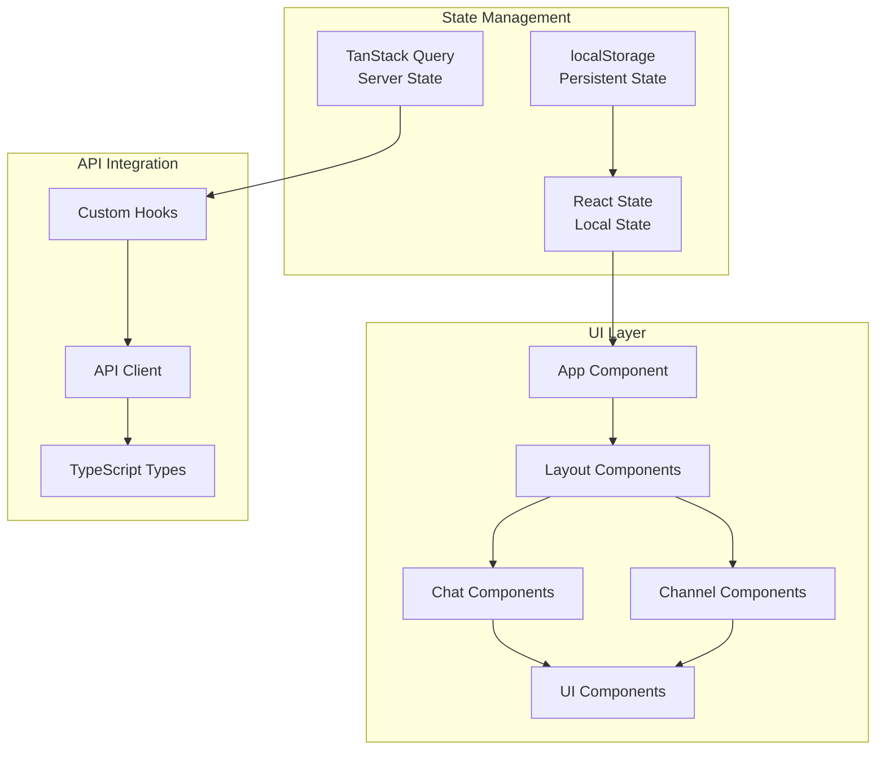

# Frontend Documentation

Welcome to the Slack Knowledge Agent frontend documentation. This documentation covers the React/TypeScript single-page application that provides the user interface for the AI-powered Slack knowledge extraction system.

## Overview

The frontend is a modern React application built with:

- **React 19**: Latest React with concurrent features and modern hooks
- **TypeScript**: Full type safety and development tooling  
- **Vite**: Fast development server and optimized production builds
- **Tailwind CSS**: Utility-first CSS framework for consistent styling
- **Shadcn/ui**: High-quality, accessible component library
- **TanStack Query**: Powerful server state management
- **Lucide React**: Beautiful, consistent icon library

## Architecture



## Documentation Structure

### Core Components
- **[Components](./COMPONENTS.md)** - Component architecture and patterns
- **[State Management](./STATE_MANAGEMENT.md)** - TanStack Query and React state patterns
- **[UI Guidelines](./UI_GUIDELINES.md)** - Design system and styling guidelines
- **[API Integration](./API.md)** - Backend API integration and types

### Development
- **[Development Setup](./DEVELOPMENT.md)** - Local development environment
- **[Testing](./TESTING.md)** - Component and integration testing
- **[Performance](./PERFORMANCE.md)** - Optimization techniques and best practices
- **[Accessibility](./ACCESSIBILITY.md)** - WCAG compliance and inclusive design

### Reference
- **[Error Handling](./ERROR_HANDLING.md)** - Error boundary and error management patterns
- **[Build and Deploy](./BUILD.md)** - Production build and deployment process

## Quick Reference

### Project Structure
```
frontend/
├── src/
│   ├── components/          # React components
│   │   ├── chat/           # Chat-specific components
│   │   ├── ui/             # Shadcn/ui base components
│   │   └── *.tsx           # Feature components
│   ├── hooks/              # Custom React hooks
│   ├── lib/                # Utility libraries and configuration
│   ├── types/              # TypeScript type definitions
│   ├── assets/             # Static assets
│   ├── App.tsx             # Main application component
│   └── main.tsx            # Application entry point
├── public/                 # Public static assets
├── docs/                   # This documentation
├── package.json            # Dependencies and scripts
├── vite.config.ts          # Vite configuration
└── tailwind.config.js      # Tailwind CSS configuration
```

### Key Technologies

| Technology | Purpose | Version |
|------------|---------|---------|
| **React** | UI framework | 19.1+ |
| **TypeScript** | Type safety | 5.5+ |
| **Vite** | Build tool | 4.5+ |
| **Tailwind CSS** | Styling | 4.1+ |
| **TanStack Query** | Server state | 5.85+ |
| **Radix UI** | Accessibility primitives | Latest |
| **Lucide React** | Icons | 0.540+ |

### Development Commands

| Command | Purpose |
|---------|---------|
| `pnpm run dev` | Start development server |
| `pnpm run build` | Build for production |
| `pnpm run preview` | Preview production build |
| `pnpm run test` | Run component tests |
| `pnpm run lint` | Run ESLint |
| `pnpm run typecheck` | TypeScript type checking |

### Component Categories

#### Layout Components
- **App**: Main application shell with routing and global providers
- **Layout**: Common layout patterns and responsive containers
- **ErrorBoundary**: Error boundary wrapper for fault isolation

#### Feature Components
- **ChatContainer**: Main chat interface with message display
- **ChatInput**: Message input with validation and submission
- **ChatMessage**: Individual message rendering with markdown support
- **ChannelSelector**: Channel selection interface with search
- **AdvancedMetadata**: Query configuration and metadata display

#### UI Components (Shadcn/ui)
- **Button**: Consistent button variants and states
- **Input**: Form inputs with validation states
- **Card**: Content containers with consistent styling
- **Dialog**: Modal dialogs for complex interactions
- **Sheet**: Sliding panels for mobile navigation

## State Management Strategy

### Server State (TanStack Query)
- **Channels**: Available Slack channels
- **Health Status**: Backend service health
- **Query Responses**: AI-generated responses from backend
- **Background Updates**: Automatic refetching and cache invalidation

### Local State (React)
- **UI State**: Loading states, modal visibility, form inputs
- **Selection State**: Selected channels, current conversation
- **Error State**: Client-side error messages and validation

### Persistent State (localStorage)
- **User Preferences**: Selected channels, UI preferences
- **Session Data**: Current conversation, draft messages

## API Integration

### Backend Endpoints
- `GET /api/health` - System health status
- `GET /api/slack/channels` - Available Slack channels  
- `POST /api/query` - Submit AI queries
- `GET /api/slack/health` - Slack service status
- `GET /api/query/health` - LLM service status

### Type Safety
All API interactions are fully typed with TypeScript:

```typescript
// Request types
interface QueryRequest {
  query: string;
  channels: string[];
  options: ConversationOptions;
}

// Response types
interface QueryResponse {
  response: string;
  metadata: ResponseMetadata;
  sources: SourceReference[];
}
```

## Development Workflow

### Getting Started
1. **Install Dependencies**: `pnpm install`
2. **Start Development**: `pnpm run dev`
3. **Verify Setup**: Open http://localhost:5173
4. **Check Backend Connection**: Ensure proxy works to http://localhost:3000

### Component Development
1. **Create Component**: Follow naming conventions and TypeScript patterns
2. **Add Tests**: Write component tests with Testing Library
3. **Update Documentation**: Document new patterns and APIs
4. **Check Accessibility**: Ensure WCAG compliance

### API Integration
1. **Define Types**: Add TypeScript interfaces for requests/responses
2. **Create Hooks**: Use TanStack Query for server state management
3. **Handle Errors**: Implement proper error handling and user feedback
4. **Test Integration**: Verify API integration with real backend

## Performance Considerations

### Bundle Optimization
- **Code Splitting**: Lazy loading for route-level components
- **Tree Shaking**: Import only used functions from libraries
- **Bundle Analysis**: Monitor bundle size and optimize imports

### React Performance
- **Memoization**: Use React.memo, useMemo, useCallback appropriately
- **Virtual Scrolling**: For large message lists (future enhancement)
- **Query Optimization**: Efficient TanStack Query configuration

### User Experience
- **Loading States**: Show loading indicators for all async operations
- **Error Handling**: Graceful error messages and recovery options
- **Responsive Design**: Mobile-first approach with proper breakpoints

## Testing Strategy

### Component Testing
- **Behavior Testing**: Test what users see and do, not implementation
- **Accessibility Testing**: Verify screen reader and keyboard navigation
- **Error State Testing**: Test error boundaries and error handling

### Integration Testing
- **API Integration**: Test API client with mock server responses
- **State Management**: Test TanStack Query hooks with mock data
- **User Flows**: Test complete user interactions end-to-end

### Testing Tools
- **Testing Library**: React component testing
- **Jest**: Test runner and assertions
- **MSW**: API mocking for integration tests
- **Axe**: Accessibility testing

## Common Patterns

### Component Structure
```typescript
interface ComponentProps {
  title: string;
  onAction?: (data: ActionData) => void;
  isLoading?: boolean;
}

export function Component({ title, onAction, isLoading = false }: ComponentProps) {
  // 1. Hooks
  const [localState, setLocalState] = useState<StateType>();
  const { data, error } = useQuery({ /* config */ });
  
  // 2. Event handlers
  const handleAction = useCallback((data: ActionData) => {
    onAction?.(data);
  }, [onAction]);
  
  // 3. Early returns
  if (isLoading) return <LoadingState />;
  if (error) return <ErrorState error={error} />;
  
  // 4. Main render
  return <MainContent />;
}
```

### Error Handling
```typescript
<ErrorBoundary
  fallback={<ErrorFallback />}
  onError={(error, errorInfo) => {
    console.error('Component error:', error, errorInfo);
  }}
>
  <MainComponent />
</ErrorBoundary>
```

### Responsive Design
```typescript
// Mobile-first responsive layout
<div className="flex flex-col lg:flex-row">
  <aside className="w-full lg:w-80 border-b lg:border-r">
    <MobileSidebar className="lg:hidden" />
    <DesktopSidebar className="hidden lg:block" />
  </aside>
  <main className="flex-1">
    <MainContent />
  </main>
</div>
```

## Next Steps

- **[Component Architecture](./COMPONENTS.md)**: Learn about component patterns
- **[State Management](./STATE_MANAGEMENT.md)**: Understand data flow patterns  
- **[Development Setup](./DEVELOPMENT.md)**: Set up your local environment
- **[UI Guidelines](./UI_GUIDELINES.md)**: Follow design system patterns

---

*For backend integration details, see the [Backend Documentation](../../backend/docs/README.md)*
