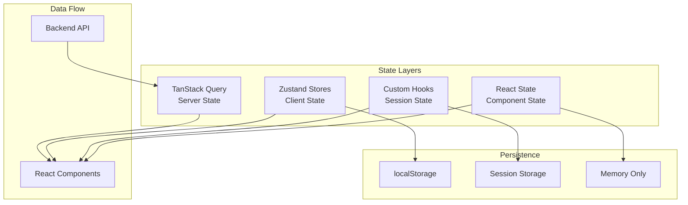

# State Management

This document provides comprehensive guidance on state management in the Slack Knowledge Agent frontend application.

## Architecture Overview

The frontend uses a multi-layered state management approach:



## 1. Server State (TanStack Query)

**Purpose**: Handle all API-related state including caching, synchronization, and background updates.

### Usage Patterns

```typescript
// Query configuration
export function useChannelsQuery() {
  return useQuery({
    queryKey: ['channels'],
    queryFn: () => apiClient.getChannels(),
    staleTime: 5 * 60 * 1000, // 5 minutes
    gcTime: 10 * 60 * 1000,   // 10 minutes
  });
}

// Mutation with optimistic updates
export function useSendMessageMutation() {
  const queryClient = useQueryClient();
  
  return useMutation({
    mutationFn: (request: QueryRequest) => apiClient.submitQuery(request),
    onSuccess: () => {
      // Invalidate related queries
      queryClient.invalidateQueries({ queryKey: ['health'] });
    },
    onError: (error) => {
      // Handle errors appropriately
      console.error('Message send failed:', error);
    },
  });
}

// Component usage
function MyComponent() {
  const { data: channels, isLoading, error } = useChannelsQuery();
  const sendMessage = useSendMessageMutation();
  
  if (isLoading) return <LoadingSpinner />;
  if (error) return <ErrorDisplay error={error} />;
  
  return <ChannelList channels={channels} />;
}
```

### Best Practices

- **Query Keys**: Use consistent, hierarchical query keys
- **Stale Time**: Set appropriate stale times to avoid unnecessary refetches
- **Error Handling**: Always handle error states in components
- **Optimistic Updates**: Use for better user experience
- **Cache Invalidation**: Invalidate queries after mutations

## 2. Client State (Zustand Stores)

**Purpose**: Manage shared application state that persists across components and sessions.

### Store Architecture

The application uses four main Zustand stores:

#### UI Store (`useUIStore`)

```typescript
export interface UIState {
  // Sidebar management
  isMobileSidebarOpen: boolean;
  toggleMobileSidebar: () => void;
  closeMobileSidebar: () => void;
  
  // View management
  currentView: 'chat' | 'settings';
  setCurrentView: (view: 'chat' | 'settings') => void;
  
  // Loading states
  isGlobalLoading: boolean;
  setGlobalLoading: (loading: boolean) => void;
  
  // Modal management
  modals: {
    settings: boolean;
    channelInfo: boolean;
    messageDetails: boolean;
  };
  openModal: (modal: keyof UIState['modals']) => void;
  closeModal: (modal: keyof UIState['modals']) => void;
}

// Usage in components
function AppLayout() {
  const isMobileSidebarOpen = useUIStore((state) => state.isMobileSidebarOpen);
  const toggleMobileSidebar = useUIStore((state) => state.toggleMobileSidebar);
  
  return (
    <div>
      <MobileSidebar 
        isOpen={isMobileSidebarOpen} 
        onToggle={toggleMobileSidebar} 
      />
    </div>
  );
}
```

#### Channel Store (`useChannelStore`)

```typescript
export interface ChannelState {
  selectedChannelIds: string[];
  channelPreferences: Record<string, ChannelPreference>;
  
  // Channel selection
  selectChannel: (channelId: string) => void;
  deselectChannel: (channelId: string) => void;
  toggleChannel: (channelId: string) => void;
  setSelectedChannels: (channelIds: string[]) => void;
  
  // Bulk operations
  selectAllChannels: (channelIds: string[]) => void;
  selectChannelsByPattern: (pattern: string, allChannels: Channel[]) => void;
  
  // Utilities
  isChannelSelected: (channelId: string) => boolean;
}

// Selector hooks for convenience
export const useSelectedChannels = () => 
  useChannelStore((state) => state.selectedChannelIds);
  
export const useHasSelectedChannels = () => 
  useChannelStore((state) => state.selectedChannelIds.length > 0);

// Usage in components
function ChannelSelector() {
  const selectedChannels = useSelectedChannels();
  const selectChannel = useChannelStore((state) => state.selectChannel);
  const hasSelectedChannels = useHasSelectedChannels();
  
  return (
    <div>
      {hasSelectedChannels && (
        <div>Selected: {selectedChannels.length} channels</div>
      )}
    </div>
  );
}
```

#### Settings Store (`useSettingsStore`)

```typescript
export interface SettingsState {
  // Theme settings
  theme: 'light' | 'dark' | 'system';
  fontSize: 'small' | 'medium' | 'large';
  compactMode: boolean;
  
  // Chat preferences
  chatSettings: {
    showTimestamps: boolean;
    showTokenUsage: boolean;
    autoScroll: boolean;
    markdownRendering: boolean;
  };
  
  // Notification settings
  notifications: {
    enabled: boolean;
    sound: boolean;
    desktop: boolean;
  };
  
  // Actions
  updateTheme: (theme: SettingsState['theme']) => void;
  updateChatSetting: <K extends keyof ChatSettings>(
    key: K, 
    value: ChatSettings[K]
  ) => void;
}

// Computed selectors
export const useEffectiveTheme = (): 'light' | 'dark' => {
  const theme = useSettingsStore((state) => state.theme);
  
  if (theme === 'system') {
    return window.matchMedia('(prefers-color-scheme: dark)').matches 
      ? 'dark' 
      : 'light';
  }
  
  return theme;
};

// Usage
function ThemeToggle() {
  const theme = useSettingsStore((state) => state.theme);
  const updateTheme = useSettingsStore((state) => state.updateTheme);
  const effectiveTheme = useEffectiveTheme();
  
  return (
    <button onClick={() => updateTheme(theme === 'light' ? 'dark' : 'light')}>
      Current: {effectiveTheme}
    </button>
  );
}
```

#### Error Store (`useErrorStore`)

```typescript
export interface ErrorState {
  errors: {
    global: string | null;
    chat: string | null;
    channels: string | null;
    api: string | null;
  };
  
  setError: (type: keyof ErrorState['errors'], error: string | null) => void;
  clearError: (type: keyof ErrorState['errors']) => void;
  clearAllErrors: () => void;
}

// Convenience selectors
export const useGlobalError = () => useErrorStore((state) => state.errors.global);
export const useHasErrors = () => useErrorStore((state) => 
  Object.values(state.errors).some((error) => error !== null)
);

// Usage with error boundaries
function ChatContainer() {
  const chatError = useErrorStore((state) => state.errors.chat);
  const setError = useErrorStore((state) => state.setError);
  
  const handleError = (error: Error) => {
    setError('chat', error.message);
  };
  
  if (chatError) {
    return <ErrorDisplay error={chatError} onDismiss={() => setError('chat', null)} />;
  }
  
  return <Chat onError={handleError} />;
}
```

### Store Implementation Patterns

#### Store Creation with Middleware

```typescript
export const useMyStore = create<MyState>()(
  devtools(
    persist(
      (set, get) => ({
        // Initial state
        value: '',
        count: 0,
        
        // Actions
        setValue: (value) => set({ value }),
        increment: () => set((state) => ({ count: state.count + 1 })),
        
        // Complex actions
        complexAction: async () => {
          const currentState = get();
          // Perform async operation
          const result = await someAsyncOperation(currentState.value);
          set({ value: result });
        },
      }),
      {
        name: 'my-store', // localStorage key
        partialize: (state) => ({
          // Only persist specific fields
          value: state.value,
          // Don't persist temporary state like loading flags
        }),
      }
    ),
    { name: 'My Store' } // DevTools name
  )
);
```

#### Selector Optimization

```typescript
// ❌ Avoid - will re-render on any store change
const entireStore = useMyStore();

// ✅ Good - only re-renders when specific value changes
const specificValue = useMyStore((state) => state.specificValue);

// ✅ Good - use shallow comparison for objects
const multipleValues = useMyStore(
  (state) => ({ 
    value1: state.value1, 
    value2: state.value2 
  }),
  shallow
);

// ✅ Good - computed selectors
const computedValue = useMyStore((state) => 
  state.items.filter(item => item.isActive).length
);
```

### Best Practices

#### Store Design
- **Single Responsibility**: Each store handles one domain of state
- **Immutable Updates**: Use immutable patterns in actions
- **Type Safety**: Always define TypeScript interfaces
- **DevTools**: Enable devtools for debugging
- **Persistence**: Use persist middleware for user preferences

#### Performance
- **Selective Subscriptions**: Subscribe only to needed state slices
- **Computed Selectors**: Create derived state in selectors
- **Shallow Comparison**: Use shallow comparison for object selections
- **Action Batching**: Batch related state updates

#### Testing
```typescript
// Test store actions
describe('useChannelStore', () => {
  beforeEach(() => {
    useChannelStore.getState().clearSelectedChannels();
  });
  
  it('should select channel', () => {
    const { selectChannel, selectedChannelIds } = useChannelStore.getState();
    
    selectChannel('channel-1');
    
    expect(selectedChannelIds).toContain('channel-1');
  });
});
```

## 3. Session State (Custom Hooks)

**Purpose**: Manage temporary state that needs to persist across the current browser session.

### Chat Session Management

```typescript
export function useChatManager() {
  const [messages, setMessages] = useState<ChatMessage[]>([]);
  const [sessionId, setSessionId] = useState(() => getOrCreateSessionId());
  const setError = useErrorStore((state) => state.setError);
  
  const sendMessage = useCallback(async (
    message: string,
    channels: string[]
  ) => {
    try {
      // Send with conversation history for backend memory sync
      const response = await sendMessageMutation.mutateAsync({
        sessionId,
        message,
        channels,
        conversationHistory: messages, // Full context
      });
      
      // Update local state
      setMessages(prev => [...prev, userMessage, aiMessage]);
    } catch (error) {
      setError('chat', error.message);
    }
  }, [sessionId, messages]);
  
  const startNewConversation = useCallback(() => {
    setMessages([]);
    const newSessionId = clearSessionId();
    setSessionId(newSessionId);
  }, []);
  
  return {
    messages,
    sessionId,
    sendMessage,
    startNewConversation,
  };
}
```

### Session Utilities

```typescript
// Session ID management
export function getOrCreateSessionId(): string {
  const existing = sessionStorage.getItem('slack-agent-session-id');
  if (existing) return existing;
  
  const newId = generateSessionId();
  sessionStorage.setItem('slack-agent-session-id', newId);
  return newId;
}

export function clearSessionId(): string {
  sessionStorage.removeItem('slack-agent-session-id');
  return getOrCreateSessionId();
}

function generateSessionId(): string {
  return 'session_' + Date.now().toString(36) + '_' + Math.random().toString(36).substr(2, 9);
}
```

## 4. Component State (React State)

**Purpose**: Handle component-specific, temporary state that doesn't need to be shared.

### Usage Guidelines

```typescript
function MyComponent() {
  // ✅ Good - component-specific UI state
  const [isDropdownOpen, setIsDropdownOpen] = useState(false);
  const [inputValue, setInputValue] = useState('');
  const [validationErrors, setValidationErrors] = useState<string[]>([]);
  
  // ❌ Avoid - state that should be shared
  // const [selectedChannels, setSelectedChannels] = useState([]); // Use Zustand
  // const [userSettings, setUserSettings] = useState({}); // Use Zustand
  
  return (
    <form>
      <input 
        value={inputValue}
        onChange={(e) => setInputValue(e.target.value)}
      />
    </form>
  );
}
```

## State Layer Decision Guide

Use this guide to choose the appropriate state management layer:

| Use Case | Layer | Example |
|----------|-------|---------|
| API data, caching | TanStack Query | Channel list, health status |
| Shared UI state | Zustand Store | Sidebar open/closed, modals |
| User preferences | Zustand Store (persisted) | Theme, settings |
| Error management | Zustand Store | Centralized error handling |
| Session continuity | Custom Hooks + sessionStorage | Chat sessions, conversation history |
| Form inputs | React State | Input values, validation |
| Component UI state | React State | Dropdown open, hover states |
| Temporary calculations | React State (useMemo) | Filtered lists, computed values |

## Migration Patterns

### From React State to Zustand

```typescript
// Before - scattered React state
function App() {
  const [selectedChannels, setSelectedChannels] = useState<string[]>([]);
  const [isSidebarOpen, setIsSidebarOpen] = useState(false);
  const [currentTheme, setCurrentTheme] = useState('light');
  
  // Lots of prop drilling...
  return (
    <Layout 
      selectedChannels={selectedChannels}
      onChannelSelect={setSelectedChannels}
      isSidebarOpen={isSidebarOpen}
      onSidebarToggle={setIsSidebarOpen}
      theme={currentTheme}
    />
  );
}

// After - centralized Zustand stores
function App() {
  return (
    <ErrorBoundary>
      <AppLayout />
    </ErrorBoundary>
  );
}

function AppLayout() {
  // Direct access to state without prop drilling
  const selectedChannels = useSelectedChannels();
  const isSidebarOpen = useUIStore((state) => state.isMobileSidebarOpen);
  const theme = useEffectiveTheme();
  
  return (
    <Layout>
      <Sidebar />
      <MainContent />
    </Layout>
  );
}
```

### Integration with External Libraries

```typescript
// Integrating Zustand with React Hook Form
function SettingsForm() {
  const settings = useSettingsStore();
  const updateChatSetting = useSettingsStore((state) => state.updateChatSetting);
  
  const { register, handleSubmit } = useForm({
    defaultValues: settings.chatSettings,
  });
  
  const onSubmit = (data) => {
    Object.entries(data).forEach(([key, value]) => {
      updateChatSetting(key, value);
    });
  };
  
  return (
    <form onSubmit={handleSubmit(onSubmit)}>
      <input {...register('showTimestamps')} type="checkbox" />
    </form>
  );
}
```

## Debugging and DevTools

### Zustand DevTools

```typescript
// Enable devtools in store creation
export const useMyStore = create<MyState>()(
  devtools(
    (set) => ({
      // store implementation
    }),
    { name: 'My Store' } // Shows up in Redux DevTools
  )
);
```

### React Query DevTools

```typescript
// Add to App.tsx in development
import { ReactQueryDevtools } from '@tanstack/react-query-devtools';

function App() {
  return (
    <>
      <MyApp />
      {process.env.NODE_ENV === 'development' && (
        <ReactQueryDevtools initialIsOpen={false} />
      )}
    </>
  );
}
```

### Logging and Monitoring

```typescript
// Add logging to store actions for debugging
const useMyStore = create<MyState>()(
  devtools(
    (set, get) => ({
      myAction: (value) => {
        console.log('MyStore: updating value', { old: get().value, new: value });
        set({ value });
      },
    }),
    { name: 'My Store' }
  )
);
```

## Common Patterns and Anti-Patterns

### ✅ Good Patterns

```typescript
// Selective subscriptions
const count = useStore((state) => state.count);

// Computed selectors
const filteredItems = useStore((state) => 
  state.items.filter(item => item.category === state.selectedCategory)
);

// Action composition
const { selectChannel, updatePreference } = useChannelStore((state) => ({
  selectChannel: state.selectChannel,
  updatePreference: state.updateChannelPreference,
}));

// Error boundaries with store integration
function ErrorBoundary({ children }) {
  const setError = useErrorStore((state) => state.setError);
  
  return (
    <ReactErrorBoundary
      onError={(error, errorInfo) => {
        setError('global', error.message);
      }}
      fallback={<ErrorFallback />}
    >
      {children}
    </ReactErrorBoundary>
  );
}
```

### ❌ Anti-Patterns

```typescript
// ❌ Don't subscribe to entire store
const wholeStore = useMyStore();

// ❌ Don't mutate state directly
const store = useMyStore();
store.items.push(newItem); // This won't trigger re-renders

// ❌ Don't put component-specific state in Zustand
const useUIStore = create((set) => ({
  // This is too specific for global state
  dropdown1Open: false,
  dropdown2Open: false,
  textInput1Value: '',
  textInput2Value: '',
}));

// ❌ Don't create too many stores
const useButtonStore = create(...);
const useInputStore = create(...);
const useModalStore = create(...);
// Better to group related state
```

## Performance Considerations

### Re-render Optimization

```typescript
// Use React.memo with Zustand selectors
const MyComponent = memo(() => {
  const specificValue = useMyStore((state) => state.specificValue);
  return <div>{specificValue}</div>;
});

// Batch updates in actions
const batchUpdateAction = () => {
  set((state) => ({
    ...state,
    field1: newValue1,
    field2: newValue2,
    field3: newValue3,
  }));
};
```

### Memory Management

```typescript
// Clean up subscriptions in useEffect cleanup
useEffect(() => {
  const unsubscribe = useMyStore.subscribe(
    (state) => state.importantValue,
    (value) => {
      // Handle value change
    }
  );
  
  return unsubscribe;
}, []);
```

---

This comprehensive guide covers all aspects of state management in the Slack Knowledge Agent frontend. For specific implementation details, refer to the source code in `src/stores/` and `src/hooks/`.