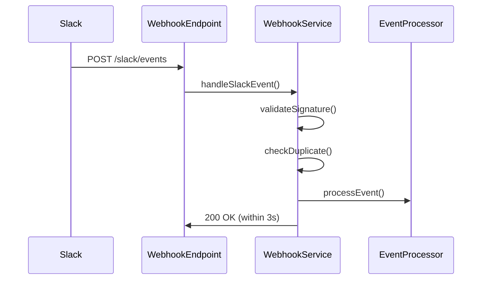
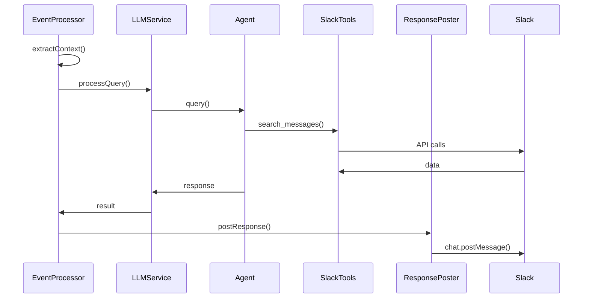

# Webhook Design Document

## Overview

This document outlines the design for adding webhook support to the Slack Knowledge Agent. The webhook functionality will allow the agent to respond to Slack events in real-time when mentioned in channels, providing a more seamless conversational experience.

## Current Architecture Analysis

### Existing Components
- **Backend API**: Express.js server with dependency injection container
- **SlackService**: Business logic for Slack operations
- **SlackApiClient**: Direct Slack Web API wrapper
- **LLMService**: AI agent orchestration service
- **SlackKnowledgeAgent**: LangChain-based conversation agent
- **ApplicationFactory**: Dependency injection and service wiring

### Current Flow
1. User visits frontend web interface
2. User selects channels and submits queries via HTTP API
3. LLMService processes query using SlackKnowledgeAgent
4. Agent uses Slack tools to gather information
5. Response is returned to user in web interface

## Webhook Design Goals

### Primary Objectives
1. **Real-time Response**: Respond to Slack mentions immediately
2. **Thread Continuity**: Post responses in the same thread where mentioned
3. **Context Awareness**: Use existing channel context and conversation memory
4. **Reliability**: Handle webhook events reliably with proper error handling
5. **Security**: Verify webhook signatures and prevent abuse

### Non-Goals
- Real-time streaming responses (initial implementation will be single response)
- Complex conversation state management across multiple channels simultaneously

## Technical Design

### Architecture Overview

```mermaid
graph TB
    Slack[Slack Platform] --> WebhookEndpoint[/slack/events]
    WebhookEndpoint --> WebhookService[WebhookService]
    WebhookService --> EventProcessor[EventProcessor]
    EventProcessor --> LLMService[LLMService]
    LLMService --> SlackKnowledgeAgent[SlackKnowledgeAgent]
    SlackKnowledgeAgent --> SlackTools[Slack Tools]
    SlackTools --> SlackAPI[Slack Web API]
    EventProcessor --> ResponsePoster[ResponsePoster]
    ResponsePoster --> SlackAPI
    
    subgraph "New Components"
        WebhookService
        EventProcessor
        ResponsePoster
    end
    
    subgraph "Existing Components"
        LLMService
        SlackKnowledgeAgent
        SlackTools
    end
```

### Component Specifications

#### 1. WebhookService

**Purpose**: Main webhook orchestration service
**Responsibilities**:
- Validate webhook signatures
- Parse and route Slack events
- Coordinate event processing
- Handle rate limiting and duplicate events
- Manage webhook health monitoring

```typescript
interface WebhookService {
  handleSlackEvent(rawBody: string, signature: string, timestamp: string): Promise<WebhookResponse>;
  validateSignature(body: string, signature: string, timestamp: string): boolean;
  isEventDuplicate(event: SlackEvent): boolean;
  getHealthStatus(): HealthStatus;
}
```

#### 2. EventProcessor

**Purpose**: Process specific Slack event types
**Responsibilities**:
- Filter relevant events (app mentions, DMs)
- Extract context (channel, thread, user, message)
- Prepare LLM context from Slack event
- Coordinate with LLMService for response generation
- Handle event-specific logic

```typescript
interface EventProcessor {
  canHandle(event: SlackEvent): boolean;
  processEvent(event: SlackEvent): Promise<ProcessingResult>;
  extractContext(event: SlackEvent): Promise<LLMContext>;
  shouldRespond(event: SlackEvent): boolean;
}
```

#### 3. ResponsePoster

**Purpose**: Post AI responses back to Slack
**Responsibilities**:
- Format responses for Slack (markdown, mentions, etc.)
- Post to correct channel/thread
- Handle posting errors and retries
- Track response status

```typescript
interface ResponsePoster {
  postResponse(response: string, context: ResponseContext): Promise<PostResult>;
  formatForSlack(content: string, context: ResponseContext): SlackMessage;
  handlePostingError(error: Error, context: ResponseContext): Promise<void>;
}
```

### Event Flow

#### 1. Webhook Reception Flow


#### 2. Event Processing Flow


### Data Models

#### SlackEvent
```typescript
interface SlackEvent {
  type: 'event_callback' | 'url_verification' | 'app_rate_limited';
  team_id: string;
  api_app_id: string;
  event?: {
    type: 'app_mention' | 'message';
    user: string;
    text: string;
    ts: string;
    channel: string;
    thread_ts?: string;
  };
  event_id?: string;
  event_time?: number;
}
```

#### WebhookContext
```typescript
interface WebhookContext {
  event: SlackEvent;
  channel: Channel;
  user: any;
  thread_ts?: string;
  mention_text: string;
  is_thread_reply: boolean;
  is_dm: boolean;
}
```

#### ResponseContext
```typescript
interface ResponseContext {
  channel_id: string;
  thread_ts?: string;
  user_id: string;
  original_message_ts: string;
  mention_context: string;
}
```

### Configuration

#### Environment Variables
```env
# Webhook Configuration
SLACK_SIGNING_SECRET=your-signing-secret
SLACK_APP_TOKEN=xapp-your-app-token  # Optional, for Socket Mode
WEBHOOK_ENABLE_SIGNATURE_VALIDATION=true
WEBHOOK_DUPLICATE_EVENT_TTL_MS=300000  # 5 minutes
WEBHOOK_PROCESSING_TIMEOUT_MS=25000    # 25 seconds (must be <30s)

# Response Configuration
WEBHOOK_ENABLE_THREADING=true
WEBHOOK_ENABLE_DMS=true
WEBHOOK_MAX_RESPONSE_LENGTH=4000
WEBHOOK_RESPONSE_FORMAT=markdown
```

#### Slack App Permissions
Required OAuth Scopes:
- `app_mentions:read` - Receive app mention events
- `channels:read` - Access channel information  
- `chat:write` - Post messages to channels
- `im:history` - Read DM history
- `im:write` - Send DMs
- `users:read` - Get user information

Event Subscriptions:
- `app_mention` - When bot is mentioned
- `message.im` - DM messages (optional)

## Implementation Strategy

### Phase 1: Core Webhook Infrastructure
1. **WebhookService Implementation**
   - Signature validation
   - Event parsing and routing
   - Basic error handling

2. **Endpoint Integration**
   - Add `/slack/events` endpoint to ApplicationFactory
   - Wire WebhookService into DI container
   - Basic event acknowledgment

3. **Configuration**
   - Add webhook config to AppConfig
   - Environment variable validation
   - Health check endpoints

### Phase 2: Event Processing
1. **EventProcessor Implementation**
   - App mention event handling
   - Context extraction from events
   - Integration with existing LLMService

2. **Response Generation**
   - Adapt existing query processing for webhook context
   - Handle channel context extraction
   - Memory integration for conversations

### Phase 3: Response Posting
1. **ResponsePoster Implementation**
   - Slack message formatting
   - Thread handling
   - Error recovery

2. **Advanced Features**
   - DM support
   - Rate limiting
   - Response length management

### Phase 4: Production Features
1. **Monitoring & Observability**
   - Webhook event metrics
   - Response time tracking
   - Error rate monitoring

2. **Resilience**
   - Retry mechanisms
   - Circuit breakers
   - Graceful degradation

## Security Considerations

### Signature Verification
- Implement strict HMAC-SHA256 signature validation
- Validate timestamp to prevent replay attacks (±5 minutes window)
- Use constant-time comparison for signatures

### Rate Limiting
- Implement per-team rate limiting
- Track duplicate events
- Handle Slack rate limit events gracefully

### Input Validation
- Sanitize all incoming event data
- Validate event structure against schemas
- Prevent injection attacks in responses

### Error Handling
- Never expose internal errors to Slack
- Log security events appropriately
- Implement proper timeout handling

## Performance Considerations

### Response Time Requirements
- Slack requires webhook responses within 3 seconds
- Process events asynchronously after acknowledgment
- Implement timeout handling for LLM requests

### Scalability
- Use existing service architecture patterns
- Leverage dependency injection for testability
- Consider event queue for high-volume scenarios

### Memory Management
- Reuse existing conversation memory patterns
- Implement cleanup for stale webhook contexts
- Monitor memory usage under load

## Testing Strategy

### Unit Tests
- WebhookService signature validation
- EventProcessor context extraction
- ResponsePoster message formatting

### Integration Tests
- End-to-end webhook flow with mock Slack events
- LLM integration with webhook context
- Error handling scenarios

### Manual Testing
- Real Slack workspace integration
- Thread conversation flows
- DM interactions
- Error scenarios

## Monitoring & Observability

### Metrics
- Webhook event count by type
- Processing time distribution
- Error rates by component
- Response success rates

### Logging
- Structured webhook event logs
- Response posting status
- Error context preservation
- Performance timing data

### Health Checks
- Webhook endpoint health
- Slack API connectivity
- Event processing queue status

## Deployment Considerations

### Configuration Management
- Environment-specific webhook URLs
- Slack app configuration per environment
- Feature flags for gradual rollout

### Backwards Compatibility
- Maintain existing API functionality
- Graceful degradation if webhook fails
- Independent deployment capability

### Rollout Strategy
1. Deploy with webhook disabled
2. Enable webhook in test workspace
3. Gradual rollout to production channels
4. Monitor and adjust based on usage

## Future Enhancements

### Potential Features
1. **Interactive Components**
   - Button responses for common actions
   - Modal dialogs for complex interactions

2. **Advanced Conversation**
   - Multi-turn conversations
   - Conversation state management
   - User preference tracking

3. **Rich Responses**
   - File attachments
   - Slack Block Kit formatting
   - Threaded response summaries

4. **Administrative Features**
   - Channel-specific configuration
   - Usage analytics dashboard
   - Response approval workflows

## Conclusion

This webhook design maintains consistency with the existing architecture while adding real-time capabilities. The modular approach allows for incremental implementation and testing, ensuring reliability and maintainability. The design prioritizes security, performance, and user experience while providing a foundation for future enhancements.
